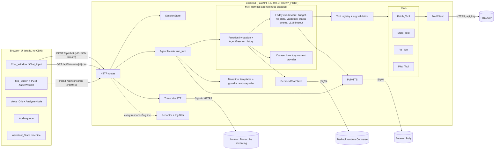
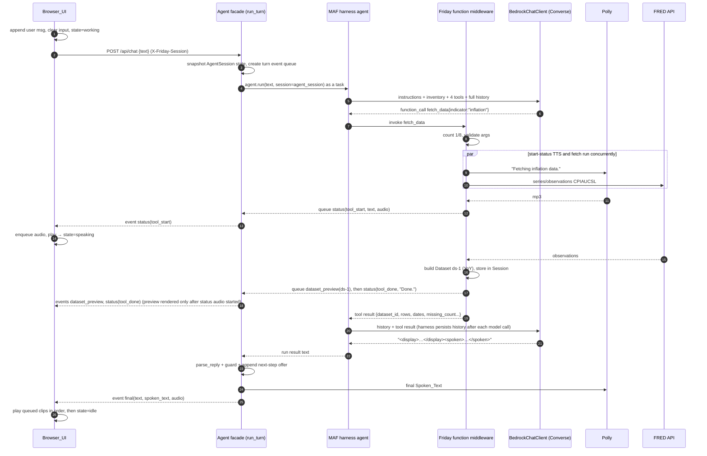
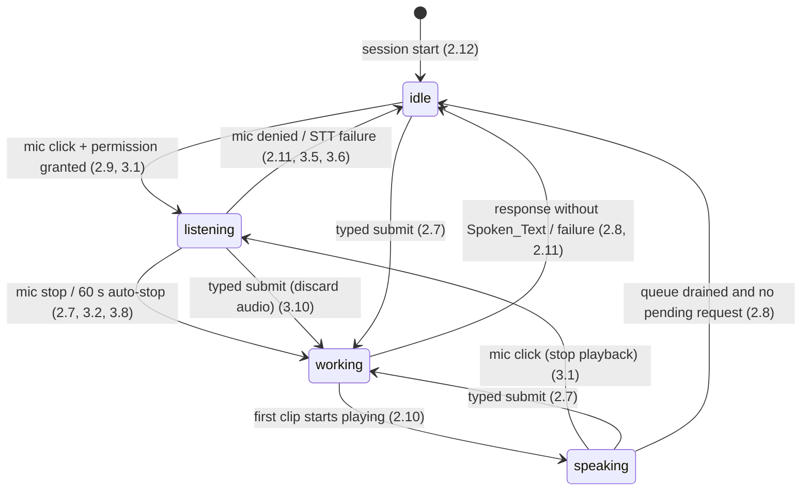

# Design Document: Friday Voice Data Assistant

## Overview

Friday is a local, single-user proof of concept. It has one Python process (FastAPI + uvicorn) that serves a static, build-free web UI and proxies every external call (Bedrock, Transcribe, Polly, FRED). The browser never sees a Credential and never calls an AWS or FRED host directly (Req 12.4, 12.5, 14.5).

A user turn works like this:

1. The browser sends typed text, or a transcript from `POST /api/transcribe`, to `POST /api/chat`.
2. The Backend's Agent facade drives a Microsoft Agent Framework (MAF) harness agent, which runs a bounded tool loop against GPT-5.6 Terra through the Bedrock Converse API.
3. The Backend streams an ordered NDJSON event stream back to the browser: status lines with audio, dataset previews, stats tables, charts, and a final message.
4. The browser renders the events, plays the audio clips one at a time, and drives the Voice_Orb from the stream and the audio levels.

Key design decisions:

| Decision | Choice | Rationale |
|---|---|---|
| Backend language | Python 3.12+ (dev machine has 3.14), FastAPI, uvicorn, managed with `uv` | One language for web, data, and plotting. `uv` gives a one-command start. |
| Frontend | Plain HTML/CSS/ES modules served by FastAPI, system fonts | No build step, no CDN (Req 14.5). |
| Data layer | numpy + stdlib `csv`/`datetime` (no pandas) | Fewer dependencies. numpy's default `percentile` method is linear interpolation (Req 9.2). |
| Plotting | matplotlib, OO API on the Agg backend, PNG | Deterministic, fixed styling. NaN values produce line gaps for free (Req 11.7). |
| Agent loop | MAF harness agent (`create_harness_agent`) with every optional harness capability disabled, the four Friday tools as MAF function tools, and Friday middleware for budget, status events, and the no-data rule | The user chose MAF over a hand-written loop. The harness supplies function invocation and per-Session history. Friday keeps control of everything the requirements make testable (Req 5.14, 5.15). |
| LLM access | MAF `BedrockChatClient` (Bedrock runtime Converse only), built from explicit `Settings` values in `llm/bedrock.py`. Suggested Model_ID `us.openai.gpt-5.6-terra` in `us-east-2`. | GPT-5.6 Terra on bedrock-runtime needs an inference-profile ID. One provider path, no Mantle adapter. |
| Deterministic narration | Templates produce tool status lines and next-step offers. The LLM writes only the summary and findings. | Req 4.4, 4.5, 4.11, and 8.1–8.5 become testable pure functions that don't depend on the LLM. |
| Transport | `POST /api/chat` returns `application/x-ndjson`, read with `fetch` + `ReadableStream` | Ordered events let "Fetching…" audio go out before the preview (Req 4.4). Simpler than SSE for POST bodies. |
| STT | Record in the browser (16 kHz mono PCM16, AudioWorklet), upload after Stop, Backend streams to Transcribe | Discarding audio on a typed submit (Req 3.10) needs audio to stay local until Stop. No S3 (Req 3.3). |

### Research findings that shape the design

- The GPT-5.6 Terra model card lists us-east-2 as supported. On bedrock-runtime (Converse), in-Region use is not supported, so requests must name the inference profile `us.openai.gpt-5.6-terra` or `global.openai.gpt-5.6-terra`. The bare ID `openai.gpt-5.6-terra` is served only by the bedrock-mantle endpoint, which Friday no longer uses. ([AWS model card: GPT-5.6 Terra](https://docs.aws.amazon.com/bedrock/latest/userguide/model-card-openai-gpt-56-terra))
- Pydantic AI's Bedrock docs confirm that Converse needs a cross-Region inference-profile ID for this model and authenticates with standard AWS credentials through SigV4. ([Pydantic AI: Bedrock](https://pydantic.dev/docs/ai/models/bedrock/))
- The MAF harness is a factory, `create_harness_agent` (Python, `from agent_framework import create_harness_agent`), that returns a normal MAF `Agent`. It composes a chat client with function invocation (configurable per-request iteration limit), per-service-call history persistence (history is saved after each model call in a tool-calling run), and optional compaction. Sessions use the standard `agent.create_session()` and `await agent.run(text, session=session)` APIs, and streaming is supported. Parameters include `client`, `name`, `harness_instructions`, `agent_instructions`, `tools`, `max_context_window_tokens`, `max_output_tokens`, and `context_providers`. `harness_instructions` is placed before `agent_instructions`, and `DEFAULT_HARNESS_INSTRUCTIONS` applies when it is not supplied. ([Microsoft Learn: Agent Harness](https://learn.microsoft.com/en-us/agent-framework/agents/harness))
- Harness defaults that are on and must be turned off for Friday: todo tracking (`disable_todo`), plan/execute modes (`disable_mode`), session file memory (`disable_file_memory`), web search (`disable_web_search`), standing approvals and auto-approval rules (`disable_tool_auto_approval`), and compaction (`disable_compaction`; compaction is also enabled when token limits are supplied). Skills, file access, shell tooling, background agents, and looping are opt-in in Python, so Friday simply does not pass them. OpenTelemetry agent observability is on by default. ([Microsoft Learn: Agent Harness](https://learn.microsoft.com/en-us/agent-framework/agents/harness))
- The MAF Bedrock provider ships as `agent-framework-bedrock` (pre-release). `BedrockChatClient` calls the Converse API and reads the model, region, and AWS credentials (including a session token) from its settings or from explicit constructor values. Its own settings use variable names such as `BEDROCK_REGION` and `BEDROCK_CHAT_MODEL`. `BedrockChatOptions` carries Bedrock-specific request options. Local function tools and tool approval work through the MAF function-invocation loop, and MAF middleware applies. Bedrock has no hosted web-search tool. ([Microsoft Learn: Amazon Bedrock provider](https://learn.microsoft.com/en-us/agent-framework/integrations/by-component/model-providers/amazon-bedrock))
- Versions: `agent-framework-core==1.20.0` (Production/Stable) and `agent-framework-bedrock==1.0.0b261002` (Beta). Both are pinned with `==`. The Bedrock package is a beta. Both install and import on Python 3.14 (confirmed in task 9.0).
- AWS's current Python Transcribe streaming client is `aws-sdk-transcribe-streaming` (installed with the `awscrt` extra for the bidirectional HTTP/2 stream). It takes 16 kHz, 16-bit mono PCM chunks through `AsyncTranscribeStreamingClient.start_stream_transcription`. The identity needs `transcribe:StartStreamTranscription`. ([AWS SDK for Python: Transcribe streaming example](https://docs.aws.amazon.com/sdk-for-python/v1/guide/getting-started-transcribe-streaming.html)) The older `amazon-transcribe` package from awslabs is the fallback if the new SDK misbehaves on Python 3.14.

Content was rephrased for compliance with licensing restrictions.

**Consequence for the LLM path.** There is one path: MAF `BedrockChatClient` on the bedrock-runtime Converse API. The `.env.example` suggestion is `us.openai.gpt-5.6-terra` in `us-east-2` (Req 12.12). There is no routing by prefix. The configured `BEDROCK_MODEL_ID` is passed to `BedrockChatClient` unchanged, so nothing about the model is hardcoded (Req 5.2). If the user sets an ID without an inference-profile prefix (for example `openai.gpt-5.6-terra`), Friday does not rewrite it. Bedrock rejects the request, `uv run friday --check` reports the classified Bedrock error, and chat turns return the Req 5.7 `llm_unavailable` response.

**Spike findings (task 9.0, confirmed).** Checked on Python 3.14.8 with `agent-framework-core==1.20.0` and `agent-framework-bedrock==1.0.0b261002`. The checks used a scripted fake chat client, a socket guard, and conflicting `BEDROCK_*`/`AWS_*`/`OTEL_*` values in the process environment, and they ran from a temp directory holding a dummy `.env`. The sections below use these results.

0. **Install.** `uv sync` and `uv sync --frozen` both accept the exact `==` pre-release pin without a `--prerelease` flag. The existing pins needed no change: pydantic 2.13.5, httpx 0.28.1, boto3/botocore 1.43.108. MAF brings in `opentelemetry-api` 1.45.1 only, with no OpenTelemetry SDK or exporter. `ruff`, `pyright` strict, and `pytest` still pass.
1. **Import paths.** Everything below comes from `agent_framework`. That package is the public façade; the private modules in parentheses are where each name is defined:
   - `create_harness_agent` and `DEFAULT_HARNESS_INSTRUCTIONS` (`_harness`).
   - `Agent`.
   - `AgentSession`, `ContextProvider`, `SessionContext`, and `InMemoryHistoryProvider` (`_sessions`).
   - `FunctionTool` (`_tools`) as the function-tool type.
   - `FunctionMiddleware`/`FunctionInvocationContext` and `ChatMiddleware`/`ChatContext`, each subclassed with `async def process(self, context, call_next)`.
   - `MiddlewareTermination`.
   - `Message`, `Content`, and `ChatResponse`.
   - Chat-client base `BaseChatClient`. A fake needs `class Fake(FunctionInvocationLayer[Any], ChatMiddlewareLayer[Any], BaseChatClient[Any])` and overrides `_inner_get_response(*, messages, stream, options, **kwargs)`, which returns an awaitable `ChatResponse`. `BedrockChatClient` uses the same layer order with `ChatTelemetryLayer` added. Request instructions arrive in `options["instructions"]` and tools in `options["tools"]`.
   - Bedrock module: `agent_framework_bedrock` defines `BedrockChatClient` and `BedrockChatOptions`. `agent_framework.amazon` is a lazy re-export of the same objects. Friday imports from `agent_framework_bedrock`. The architecture test bans both prefixes outside `llm.bedrock` and `wiring`.
   - Context-provider hook: subclass `ContextProvider`, call `super().__init__(source_id)`, and implement `async def before_run(self, *, agent, session, context: SessionContext, state)` with `context.extend_instructions(self.source_id, text)`. The provider text is appended to the instructions on every model call of the run.
2. **Disable flags.** The names are exactly `disable_todo`, `disable_mode`, `disable_file_memory`, `disable_web_search`, `disable_tool_auto_approval`, and `disable_compaction`. With all of them set, the request carries only Friday's tools and instructions equal to `harness_instructions + "\n\n" + agent_instructions`. No `DEFAULT_HARNESS_INSTRUCTIONS` are sent. The only context provider left is `InMemoryHistoryProvider`. The only middleware left is the always-added `MessageInjectionMiddleware`, which is harmless and adds a `message_injection.pending_messages` state key. No `agent-file-memory/` directory is created and no experimental warning is raised. The default harness creates `./agent-file-memory`, which Friday avoids by disabling file memory. What each flag removes:
   - `disable_todo` removes the 5 `todos_*` tools and their instructions.
   - `disable_mode` removes `mode_get`/`mode_set` and their instructions.
   - `disable_file_memory` removes the 7 `file_memory_*` tools and their instructions.
   - `disable_web_search` removes `web_search`. That tool only appears when the client has `get_web_search_tool`, and `BedrockChatClient` does not.
   - `disable_tool_auto_approval` removes `ToolApprovalMiddleware`.
   - `disable_compaction` leaves the compaction strategy `None`.
   - `loop_max_iterations` (default 10) has no effect unless `loop_should_continue` is passed.
3. **Limits.** These are not `create_harness_agent` parameters. They go on the chat client as `function_invocation_configuration={"max_iterations": MAX_TOOL_CALLS + 1, "max_consecutive_errors_per_request": MAX_TOOL_CALLS + 1, "allow_concurrent_invocation": False}`, which both `BedrockChatClient(...)` and the fake's base `__init__` accept. The defaults are 40 iterations, 3 consecutive errors, and concurrent invocation on. When `max_iterations` is reached, the run returns MAF's own text "Function invocation limit reached before a final answer could be produced." Friday's 9th-call termination fires first, so this backstop is never reached in practice. Concurrent invocation is turned off so the status events of the tools in one model response are queued in call order.
4. **Unknown names and validation.** Calls to unknown tool names never reach function middleware. MAF answers them with the tool result `Error: Requested function "<name>" not found.`, which names the tool, so Friday keeps that error (Req 5.8). The chat middleware sees them in `context.result` after `call_next()` and counts them. MAF validates arguments inside `call_next()`, after function middleware: with a JSON-schema `input_model` it checks only required and unexpected names, and with a Pydantic class it validates fully. Friday's middleware validates first, so MAF's generic `Error: Argument parsing failed.` is never produced for Friday tools. Arguments that are not valid JSON reach middleware as `{"raw": "<text>"}`, and `ToolRegistry.validate` rejects them with named-field errors. `context.function.name` holds the tool name and `context.arguments` the raw mapping.
5. **Short-circuit and terminate.** To skip a tool, set `context.result = <json str>` and return without `call_next()`. The tool does not run, and the result goes back to the model. To terminate, set `context.result` and then `raise MiddlewareTermination(...)`. `agent.run` returns normally with empty `.text`. Its `response.messages` end with a `tool` message holding the results of the whole batch. Any other calls in that batch still pass through the middleware, so with Friday's monotonic counter they also get `tool_limit`. The harness does **not** persist that trailing `tool` message, so the stored history ends with unpaired function calls. Friday therefore appends the trailing `tool` messages from the response plus the fixed outcome text before the turn ends (see `run_turn` step 5). Short-circuiting the next model call from chat middleware instead loses history and must not be used.
6. **Sessions.** `AgentSession.to_dict()` returns a JSON-serializable dict: `{type, session_id, service_session_id, state}`, with messages serialized under `state["in_memory"]["messages"]`. To snapshot, take `to_dict()`. To restore, set `agent_session.state = AgentSession.from_dict(snapshot).state` on the same object. A model error raised inside a run propagates out of `agent.run` unchanged (the fake's `RuntimeError` arrived unwrapped, with no `__cause__`). History from earlier successful model calls in the turn stays persisted, so the rollback is needed. To append a plain assistant message, Friday passes its own `InMemoryHistoryProvider()` as `history_provider=` and calls `await history.save_messages(agent_session.session_id, [Message(role="assistant", contents=[text])], state=agent_session.state[history.source_id])`. The next turn's request includes it.
7. **Timeout.** `BedrockChatClient` accepts a prebuilt `client=` (a `bedrock-runtime` `BaseClient`, used as-is) and a `boto3_session=`. It runs the blocking Converse call through `asyncio.to_thread`, so `asyncio.wait_for` in chat middleware returns on time while the thread finishes on its own. botocore `Config` is therefore used on a prebuilt client: `Config(read_timeout=60, connect_timeout=5, retries={"total_max_attempts": 1})`. `{"max_attempts": 1}` means one retry (2 attempts in total), so it is not used. An exception raised in chat middleware (for example the mapped timeout) propagates out of `agent.run`. Bedrock `ClientError`s are re-raised raw. The one exception is an `outputConfig` `ValidationException`, which becomes a `ValueError` chained with `from e`.
8. **Environment.** The finding and the fallback Friday uses:
   - **Finding:** `BedrockChatClient.__init__` always calls MAF `load_settings(prefix="BEDROCK_")`. Explicit non-`None` values win. Any field passed as `None` falls back to the matching `BEDROCK_*` variable: with explicit keys and `session_token=None`, the client used `BEDROCK_SESSION_TOKEN` from the environment. A `.env` file is read only when `env_file_path` is passed, and a dummy `.env` in the working directory was ignored.
   - **Chosen fallback:** `make_chat_client` builds the `bedrock-runtime` client itself and passes `client=`, `model=`, and `region=` explicitly. With `client=`, the environment values that `load_settings` still resolves for the credential fields are discarded. The client's credentials, region, and model then match `Settings` exactly, even with conflicting `BEDROCK_*`/`AWS_*` variables set.
   - **boto3 caveat:** boto3 itself still reads `AWS_PROFILE`, `AWS_CONFIG_FILE`, and `AWS_SHARED_CREDENTIALS_FILE` when explicit keys are given. A missing `AWS_PROFILE` raised `ProfileNotFound`. The client is therefore built from `boto3.Session(botocore_session=botocore.session.Session(session_vars={"profile": (None, None, None, None), "config_file": (None, None, os.devnull, None), "credentials_file": (None, None, os.devnull, None)}), aws_access_key_id=..., aws_secret_access_key=..., aws_session_token=... or None, region_name=...)`. The Polly and STS clients in `speech/*` and `check.py` reuse the same session builder. The builder also sets `"ignore_configured_endpoint_urls": (None, None, True, None)`, so `AWS_ENDPOINT_URL`, `AWS_ENDPOINT_URL_<SERVICE>`, and `AWS_IGNORE_CONFIGURED_ENDPOINT_URLS` cannot redirect any client away from the default AWS endpoint (checked with botocore 1.43.108).
   - **MAF's own variables:** At import, MAF also reads `ENABLE_INSTRUMENTATION`, `ENABLE_SENSITIVE_DATA`, `ENABLE_CONSOLE_EXPORTERS`, `ENABLE_MESSAGE_EVENTS`, `OTEL_SEMCONV_STABILITY_OPT_IN`, `VS_CODE_EXTENSION_PORT`, `AGENT_FRAMEWORK_USER_AGENT_DISABLED`, and `AGENT_FRAMEWORK_FEATURE_MASK_DISABLED`. These are MAF's own flags, not Friday settings, and none of them leads to a network call (item 9).
9. **Telemetry.** With only `opentelemetry-api` installed, the tracer provider is the no-op `ProxyTracerProvider`. A full harness run with tool calls made zero socket connections, even with `OTEL_EXPORTER_OTLP_ENDPOINT`, `OTEL_TRACES_EXPORTER=otlp`, and `ENABLE_CONSOLE_EXPORTERS=true` set. MAF's setup state stays `is_setup=False`. Friday must never call `agent_framework.observability.configure_otel_providers(...)` or `enable_instrumentation(...)` with exporters. Those helpers read `OTEL_EXPORTER_OTLP_*`, can `load_dotenv(env_file_path)`, and need `opentelemetry-sdk`. Friday must also not add `opentelemetry-sdk`, an exporter package, or `opentelemetry-instrument`. Telemetry spans stay in-process.

## Architecture



### Process and startup

`./start.sh` is the single Start_Command (Req 13.1). It is three lines:

```sh
#!/bin/sh
uv sync --frozen || { echo "Friday: dependency installation failed" >&2; exit 1; }
exec uv run --no-sync friday "$@"
```

`friday` is a console script (`friday.cli:main`). Startup order, with each failure exiting non-zero before any HTTP request is accepted:

1. If `./.env` exists, load it with `python-dotenv` using `override=False`, so values already in the process environment win (Req 12.2, 12.10).
2. Build `Settings` with `load_settings(environ)`. All missing required variables are collected into one error message that names them (Req 12.6). Defaults are applied to optional settings (Req 12.3).
3. Validate `FRIDAY_PORT`. Blank means 8000. The value must be an integer from 1 to 65535 (Req 13.3, 13.5).
4. Load the Indicator_Map from `INDICATOR_MAP_PATH`, or from the packaged `default_indicators.json` (Req 6.1, 12.7).
5. Attach the `RedactingFilter` to the root logger's handler, and run uvicorn with `log_config=None` so its loggers propagate to that handler. A filter on a logger does not see records from child loggers, so it goes on the handler. Set `httpx`/`httpcore` to WARNING so request URLs containing `api_key` are never logged (Req 12.4). Set `agent_framework` and `botocore` loggers to WARNING too, so prompts, tool arguments, and signed request headers are not logged at debug level. Their records still pass through the handler's `RedactingFilter`. Friday never calls MAF's observability setup helpers and configures no OpenTelemetry exporter, so harness telemetry stays in-process (confirmed, spike item 9: never call `configure_otel_providers` or add `opentelemetry-sdk`/exporters).
6. Create a socket and bind it to `127.0.0.1:port` manually. Map `EADDRINUSE` to "port in use" and `EACCES` to "bind not permitted" (Req 13.2, 13.5).
7. Build the app with `create_app(build_container(settings), on_ready=...)` and run `uvicorn.Server(config).serve(sockets=[sock])` with `timeout_graceful_shutdown=3`. The lifespan startup hook calls the `on_ready` callback from `cli.py`, which prints `Friday is running at http://127.0.0.1:<actual port>`, taking the port from `sock.getsockname()` (Req 13.4).
8. Make a non-blocking STS `GetCallerIdentity` probe in the background. If it returns an AWS_Credential_Error, log a redacted warning: "AWS credentials look expired or invalid — refresh .env and restart." The server still starts, and requests show the Req 5.12 message.

Ctrl+C is handled by uvicorn's SIGINT handling. The graceful timeout is 3 s, so the process exits and releases the port well inside 5 s (Req 13.8).

### Turn sequence: "please pull inflation"



### Assistant_State machine (browser)



The machine is a pure reducer in `static/js/state.js`: `reduce(state, event, ctx) -> state`, where `ctx` carries `pendingRequests` and `queueLength`. Mic clicks while in `working` are no-ops (Req 3.9). The DOM layer applies the state by setting `data-state` on the orb within one animation frame (Req 2.6).

## Components and Interfaces

### Configuration (`friday/config.py`)

```python
@dataclass(frozen=True)
class Settings:
    aws_access_key_id: str
    aws_secret_access_key: str
    aws_session_token: str | None
    aws_region: str
    fred_api_key: str
    bedrock_model_id: str
    polly_voice_id: str = "Joanna"
    polly_engine: str = "neural"
    transcribe_language_code: str = "en-US"
    indicator_map_path: str | None = None
    port: int = 8000

REQUIRED = ["AWS_ACCESS_KEY_ID", "AWS_SECRET_ACCESS_KEY", "AWS_REGION",
            "FRED_API_KEY", "BEDROCK_MODEL_ID"]

def read_environment(dotenv_path: Path) -> dict[str, str]  # dotenv_values() overlaid with os.environ; the only env read
def load_settings(env: Mapping[str, str]) -> Settings   # raises ConfigError(missing=[...])
def parse_port(raw: str | None) -> int                  # raises PortError(value, "invalid value")
def secret_values(s: Settings) -> list[str]             # values fed to the Redactor
```

`load_settings` is pure. It takes the merged mapping from `read_environment`, which reads `.env` with `dotenv_values()` (so `os.environ` is never mutated) and overlays `os.environ`. A value that is empty or only whitespace counts as unset. No other module reads the environment. `Settings` is passed explicitly from there.

### Redactor (`friday/redact.py`)

```python
class Redactor:
    def __init__(self, secrets: Iterable[str], min_fragment: int = 8): ...
    def redact(self, text: str) -> str
class RedactingFilter(logging.Filter): ...   # rewrites record.msg/args via Redactor
```

The Redactor builds a set of every 8-character window of every Credential value. It scans the text and masks every maximal span covered by a matching window with `[REDACTED]`. This covers a Credential "in full or in part" for any fragment of 8 characters or more (Req 5.13, 12.4). Shorter fragments can't be told apart from ordinary text. As defense in depth, it also masks AWS key-ID patterns (`(AKIA|ASIA)[A-Z0-9]{16}`) and `api_key=` query values. Every place text can leave the process goes through the Redactor: JSON error bodies, NDJSON events, the `--check` output, and logs.

### Session store (`friday/session.py`)

```python
class SessionStore:
    def __init__(self, new_agent_session: Callable[[], AgentSession]): ...  # harness_agent.create_session
    def get_or_create(self, session_id: str) -> Session  # session_id must be a UUID string
    def end(self, session_id: str) -> None
    def evict_idle(self, max_idle_s: float = 7200) -> None
```

The browser generates `crypto.randomUUID()` on page load and sends it as the `X-Friday-Session` header, or as the `session` query parameter for CSV links. `navigator.sendBeacon('/api/session/end')` on `pagehide` discards the session. A session ID that is not a hyphenated UUID raises `RequestError("invalid_session")` (HTTP 400); `end` ignores such IDs. Idle eviction (injectable monotonic clock) is a safety net and skips a Session whose lock is held. Each Session has an `asyncio.Lock`, so turns within a Session run one at a time. Each Friday Session owns one MAF `AgentSession` (created through the injected factory), which holds the conversation history the harness persists.

### HTTP API (`friday/server.py`)

| Method & path | Request | Response |
|---|---|---|
| `GET /` and `/static/*` | — | UI files (index.html, css, js, worklet) |
| `POST /api/chat` | JSON `{ "text": str (1–2000 chars after trim) }`, header `X-Friday-Session`, body at most 16 KiB | `200 application/x-ndjson` event stream (see Data Models). `400 invalid_text` for invalid text, `413 request_too_large` for an oversized body. |
| `POST /api/transcribe` | body: raw PCM16LE mono 16 kHz, `Content-Type: application/octet-stream`, at most 2.5 MB (about 78 s) | `200 {"text": str}`, or `4xx/5xx {"error": {"code", "message"}}` with code in `stt_failed`, `stt_timeout`, `stt_empty`, `aws_credentials`, `audio_too_large` |
| `GET /api/datasets/{dataset_id}.csv?session=…` | — | `200 text/csv` with `Content-Disposition: attachment; filename="{SERIES}_{indicator-slug}_{dataset_id}.csv"`, or `404 {"error": {"code": "dataset_not_found"}}` |
| `POST /api/session/end` | header or beacon body with session ID | `204` |

The audio is held only in request memory. It is never written to disk or to any AWS storage (Req 3.3).

`create_app(container, on_ready)` builds the routes from an injected `Container` (see Engineering Standards). It installs three middlewares: `TrustedHostMiddleware` (`127.0.0.1`, `localhost`), a security-headers middleware (CSP and related headers), and a body-size limit that checks `Content-Length` and counts streamed bytes.

### Agent (`friday/agent/loop.py`, `agent/harness.py`, `agent/middleware.py`)

`Agent` is Friday's facade. Its signature and the NDJSON event contract stay the same, so `server.py` and `events.py` don't change. Internally it drives one MAF harness agent, built once in `wiring.py` and shared by all Sessions. Per-Session state lives in each Session's `AgentSession`. In code, MAF is imported as `import agent_framework as maf` so `maf.Agent` never collides with Friday's `Agent`.

```python
from friday.constants import MAX_TOOL_CALLS, LLM_TIMEOUT_S, TTS_TIMEOUT_S   # 8, 60, 15

class Agent:
    def __init__(self, harness: maf.Agent, tts: TTSClient, tools: ToolRegistry,
                 redactor: Redactor): ...
    async def run_turn(self, session: Session, user_text: str) -> AsyncIterator[Event]
```

#### Building the harness agent (`agent/harness.py`)

```python
def build_harness_agent(chat_client: maf.BaseChatClient, tools: ToolRegistry,
                        middleware: FridayMiddleware,
                        history: maf.InMemoryHistoryProvider) -> maf.Agent:
    # FridayMiddleware(tools, tts, map_llm_error) holds the function and chat middleware.
    # `history` is Friday's own instance so run_turn can append messages (spike item 6).
    return maf.create_harness_agent(
        client=chat_client,
        name="Friday",
        harness_instructions=FRIDAY_RULES,      # Friday's own rules, never DEFAULT_HARNESS_INSTRUCTIONS
        agent_instructions=FRIDAY_PERSONA,
        tools=tools.function_tools(current_turn),  # exactly the four Friday tools; current_turn reads the TurnContext contextvar
        history_provider=history,
        context_providers=[DatasetInventoryProvider()],
        disable_todo=True, disable_mode=True, disable_file_memory=True,
        disable_web_search=True, disable_tool_auto_approval=True, disable_compaction=True,
        # not passed (opt-in, so off): skills_provider/skills_paths, file_access_store,
        # background agents, shell tooling, loop evaluators.
        # not passed: max_context_window_tokens (supplying token limits enables compaction).
        middleware=[middleware.function, middleware.chat],
        # Iteration/consecutive-error limits are not harness parameters: they are the chat
        # client's function_invocation_configuration, set in make_chat_client (spike item 3).
    )
```

- **Instructions.** `harness_instructions` is set to Friday's fixed rules text (the rules from the System prompt section below), so `DEFAULT_HARNESS_INSTRUCTIONS` and its planning and todo guidance never reach the model. `agent_instructions` is the Friday persona. Both strings are defined in `agent/prompts.py`, which reuses wording from `agent/templates.py`. They are sent with every request (Req 5.6).
- **Dataset inventory.** `DatasetInventoryProvider` is a MAF context provider. Before each run it adds per-run instructions listing the current Session Datasets (ID, indicator, rows, range, missing count) with the most recent one marked (Req 8.4). It reads the Friday Session from the turn context (below). It subclasses `ContextProvider` (`super().__init__("friday_inventory")`) and implements `async def before_run(self, *, agent, session, context, state)`, calling `context.extend_instructions(self.source_id, text)` (spike item 1).
- **Tools.** `ToolRegistry.function_tools()` wraps each of the four tools as a MAF function tool. Its input schema is the JSON schema from the tool's frozen Pydantic arg model (`model_json_schema()`), so one definition still serves the LLM schema and validation. Each tool is a `FunctionTool(name=..., description=..., func=..., input_model=<schema dict>, approval_mode="never_require")`. Friday's function middleware calls `ToolRegistry.validate` on the raw arguments before the tool body runs, so a validation error is returned as Friday's named-field tool error (Req 5.8, 10.10). MAF validates only inside `call_next()`, after the middleware (spike item 4). Its validation therefore never sees invalid arguments, and no conversion is needed.
- **Compaction is off** (`disable_compaction=True`, no token limits passed), so the harness sends the full Session history on every model call (Req 5.1, 5.3). Max output tokens, if needed, go in `BedrockChatOptions`, not in the harness token-limit parameters.
- **Telemetry.** MAF agent observability stays at its default, but Friday configures no exporter, so spans never leave the process. Confirmed in spike item 9: only `opentelemetry-api` is installed and no sockets are opened even with `OTEL_*` set. Friday never calls `configure_otel_providers`. A test-suite network guard fails any non-loopback connection during offline tests.

#### Turn context and middleware (`agent/middleware.py`)

`run_turn` creates a `TurnContext` and sets it in a `contextvars.ContextVar` before starting the harness run. Asyncio tasks copy the context, so the middleware and the context provider see the right turn even when several Sessions run at once. The spike confirmed that a `ContextVar` set before `agent.run` is visible in the function middleware, the chat middleware, and `before_run`. MAF also supports run-level `agent.run(..., middleware=[...])` and `function_invocation_kwargs=` (which surface in `FunctionInvocationContext.kwargs`). Friday keeps the `ContextVar` because it alone also reaches the context provider.

```python
@dataclass
class TurnContext:
    session: Session                 # Friday Session (datasets, charts, FRED cache)
    events: asyncio.Queue[Event]     # drained by run_turn
    calls: int = 0                   # every requested tool call, including rejected ones
    outcomes: list[ToolOutcome]      # for next_step_offer
    stop: Literal["tool_limit", "no_data"] | None = None
    llm_error: FridayError | None = None
```

**Function middleware** wraps every function invocation, in this order:

1. `calls += 1`. If `calls > MAX_TOOL_CALLS`, the Tool is skipped: the middleware returns an `{ok:false, error:{kind:"tool_limit"}}` result without calling it, sets `stop="tool_limit"`, and terminates the run. Datasets and charts from the first 8 calls stay in the Session (Req 5.9). Returning a result for the skipped call keeps every model tool call paired with a tool result in history, which Converse requires on the next turn.
2. If the tool is `describe_data`, `fill_missing`, or `plot_data` and `session.datasets` is empty, it returns an `{ok:false, error:{kind:"no_data"}}` result without calling the Tool, sets `stop="no_data"`, and terminates the run (Req 8.6).
3. `ToolRegistry.validate(name, raw_args)`. On failure it returns the named-field error result without calling the Tool and emits no status event. The call still counts (Req 5.8).
4. It queues `status(tool_start)` with `narration.start_line(...)` and starts the start-line TTS concurrently with the Tool. The `tool_start` event is queued before the Tool's display event (Req 4.4).
5. It calls `next(context)`, which invokes the registered function tool. The function tool body is `ToolRegistry.run(turn.session, validated_args)`. It catches any exception inside the Tool and turns it into `{ok:false, tool, error}`, so nothing is added to the Session and MAF never sees a Tool exception (Req 5.11). It records the `ToolOutcome` in `TurnContext.outcomes`.
6. It queues the outcome's display event (`dataset_preview`, `stats_table`, or `chart`), then `status(tool_done)` with `done_line` or `status(tool_error)` with `error_line` (Req 4.5, 4.11). The JSON tool result goes back to the harness, which adds the call and result to history (Req 5.3).

Skipping and terminating (confirmed in spike item 5). To skip a Tool, set `context.result = json_result` and return without calling `call_next()`. To terminate, which steps 1 and 2 do, set `context.result` and then `raise MiddlewareTermination(...)`. `agent.run` then returns normally with empty text. The batch's tool results are in `response.messages` but are not persisted by the harness, so `run_turn` step 5 appends them. Other calls in the same model response still pass through the middleware. The counter is monotonic, so every call past the 8th also gets `tool_limit`. Tools run one at a time (`allow_concurrent_invocation=False`), so status events follow call order.

**Unknown tool names.** Confirmed in spike item 4: unknown names never reach function middleware. The chat middleware counts each unknown-name function call in the model response (`context.result` after `call_next()`) toward `calls`. MAF returns `Error: Requested function "<name>" not found.` to the model. That error names the tool, so Friday keeps it (Req 5.8). MAF's `max_consecutive_errors_per_request` is set to `MAX_TOOL_CALLS + 1`, so Friday's budget governs and not MAF's (default 3).

**Chat middleware** wraps each model call:

- It enforces the 60 s per-request limit with `asyncio.wait_for(next(...), LLM_TIMEOUT_S)` (Req 5.7). `BedrockChatClient` accepts a prebuilt client (spike item 7), so `llm/bedrock.py` also builds the `bedrock-runtime` client with `Config(read_timeout=60, connect_timeout=5, retries={"total_max_attempts": 1})`. The `wait_for` stays as the authoritative limit. Converse runs in `asyncio.to_thread`, so `wait_for` returns on time, and botocore's `read_timeout` bounds the leftover thread. An exception raised here propagates out of `agent.run`.
- It maps exceptions into `AwsCredentialError` or `LLMUnavailableError` with an injected `map_llm_error: Callable[[BaseException], FridayError]`, stores the result in `TurnContext.llm_error`, and raises it so the run stops. `map_llm_error` lives in `llm/bedrock.py` (an adapter, built on `classify_aws_error`) and is passed in by `wiring.py`, so the application layer never imports `aws_errors` or botocore.
- It applies the unknown-name counting fallback described above.

The function-invocation iteration limit (`function_invocation_configuration["max_iterations"]` on the chat client, spike item 3) is set to `MAX_TOOL_CALLS + 1` model round trips as a backstop. It is not the budget, because one model response can request several calls. The middleware counter is the budget.

#### `run_turn` algorithm

1. `snapshot = snapshot_state(session.agent_session)`, which is `agent_session.to_dict()`: a JSON-serializable copy with the messages serialized. `restore_state(agent_session, snapshot)` sets `agent_session.state = AgentSession.from_dict(snapshot).state` on the same object (spike item 6). Create the `TurnContext`.
2. Start `harness.run(user_text, session=session.agent_session)` as a task (non-streaming; model text is not streamed to the browser because it must pass the guard first). While the task runs, yield events from the queue as they arrive. After the task finishes, drain the queue.
3. On `AwsCredentialError`: `restore_state(session.agent_session, snapshot)` and emit `final(outcome="aws_credentials")` with no TTS call (Req 5.12).
4. On `LLMUnavailableError`, a timeout, or any other harness error: restore the snapshot and emit `final(outcome="llm_unavailable")` (Req 5.7).
   Rollback is needed because the harness persists history after each model call. Without it, a failure on the second model call of a turn would leave the first call's messages in history. Datasets and charts produced earlier in a failed turn stay in the Session. Req 5.7 and 5.12 cover only conversation history.
5. On `stop == "tool_limit"` or `stop == "no_data"`: emit `final` with the fixed outcome text (Req 5.9, 8.6). The harness has persisted the user message and the tool calls, including the results of earlier model round trips. It has **not** persisted the final batch's tool results, because `MiddlewareTermination` skips that save (spike item 5). Friday appends the trailing `tool` messages from the run response, then the fixed outcome text as an assistant message. Both go through `await history.save_messages(agent_session.session_id, [*trailing_tool_messages, Message(role="assistant", contents=[text])], state=agent_session.state[history.source_id])`. Every function call is then paired with a result (Converse requires this), and the next turn sees a complete exchange (spike item 6).
6. Otherwise the run result text is the final text (Req 5.10):
   - `display, spoken = parse_reply(text)`.
   - `display, spoken = narration.guard(display, spoken, grounded_numbers(session), fixed_words)`.
   - `offer = narration.next_step_offer(outcomes, session)`, appended to both display and spoken (Req 8.1–8.5).
   - Synthesize TTS with a 15 s timeout and emit `final(outcome="ok")`. The harness has already stored the model's reply in the `AgentSession`. Friday does not store the guarded text separately, so the history matches what the model produced.

Narration, `guard`, `parse_reply`, `next_step_offer`, and the Redactor stay Friday code. They run on the harness output; MAF never sees them. The Agent never turns LLM text into data. Datasets, statistics, and charts come only from Tool return values (Req 5.5).

### LLM client (`friday/llm/bedrock.py`)

```python
from agent_framework_bedrock import BedrockChatClient   # spike item 1

def make_chat_client(s: Settings) -> BedrockChatClient:
    """Build the MAF Bedrock Converse client from explicit Settings values only."""
    runtime = isolated_boto3_session(s).client(          # ignores AWS_PROFILE/config files (spike item 8)
        "bedrock-runtime",
        region_name=s.aws_region,
        config=Config(read_timeout=60, connect_timeout=5,  # values from constants.py
                      retries={"total_max_attempts": 1}),  # no retries (spike item 7)
    )
    return BedrockChatClient(
        client=runtime,                           # prebuilt: BEDROCK_* credential env values are discarded
        model=s.bedrock_model_id,                 # passed through unchanged (Req 5.2)
        region=s.aws_region,
        function_invocation_configuration={
            "max_iterations": MAX_TOOL_CALLS + 1,
            "max_consecutive_errors_per_request": MAX_TOOL_CALLS + 1,
            "allow_concurrent_invocation": False,
        },
        # env_file_path is never passed, so no .env is read by MAF.
    )

def isolated_boto3_session(s: Settings) -> boto3.Session:
    """boto3 session from explicit Settings credentials; no profile or shared-config lookup."""
    core = botocore.session.Session(session_vars={
        "profile": (None, None, None, None),
        "config_file": (None, None, os.devnull, None),
        "credentials_file": (None, None, os.devnull, None),
    })
    return boto3.Session(botocore_session=core,
                         aws_access_key_id=s.aws_access_key_id,
                         aws_secret_access_key=s.aws_secret_access_key,
                         aws_session_token=s.aws_session_token,   # None when unset (Req 12.11)
                         region_name=s.aws_region)
```

- `llm/bedrock.py` is the only module that imports the MAF Bedrock package. `wiring.py` calls `make_chat_client`. The old `LLMClient` Protocol, `Message`/`ToolCall`/`LLMReply` types, `llm/base.py`, `llm/mantle.py`, and `llm/converse.py` are dropped. The MAF chat-client base class is now the port the application layer depends on.
- **No environment influence from MAF or boto3.** Only `config.py` reads the environment for Friday settings (Engineering Standards). The spike (item 8) showed that `BedrockChatClient` built from explicit keys still falls back to `BEDROCK_*` variables for any value passed as `None`: an unset session token picked up `BEDROCK_SESSION_TOKEN`. It also showed that boto3 reads `AWS_PROFILE` and the shared config files even with explicit keys. Friday therefore uses the prebuilt-client fallback shown above. It never passes `env_file_path` (no `.env` is read), it always passes `model` and `region`, and it builds the client from `isolated_boto3_session`. MAF still calls `os.getenv` for the `BEDROCK_*` credential fields internally, but those values are discarded when `client=` is given. A unit test sets conflicting `BEDROCK_CHAT_MODEL`, `BEDROCK_REGION`, `BEDROCK_*` credential, `AWS_*`, and `AWS_PROFILE` values in a monkeypatched process environment. It asserts that the client's model, region, and signer credentials are the Settings values, including a `None` session token. `isolated_boto3_session` lives in an adapter-layer helper that the Polly, Transcribe, and STS (`--check`) clients reuse. Its placement is confirmed: `friday/aws_session.py`, in the adapter layer (`LAYER_OF["aws_session"]` in `tests/test_architecture.py`).
- `map_llm_error(exc) -> FridayError` (also in `llm/bedrock.py`) turns a harness or Bedrock exception into `AwsCredentialError` (for `CREDENTIAL`) or `LLMUnavailableError` (for `TIMEOUT` and `OTHER`), with a redacted message.
- **`classify_aws_error(exc) -> ErrorKind`** (`friday/aws_errors.py`) is pure. It walks the exception chain (`exc`, then `__cause__`, then `__context__`, with a visited set to stop cycles) until it finds a botocore `ClientError`, an HTTP 401/403 body `code`/`__type`, a smithy exception name, or a timeout type (`asyncio.TimeoutError`, botocore `ReadTimeoutError`/`ConnectTimeoutError`). MAF may wrap provider errors in its own exception types. The spike found that `BedrockChatClient` re-raises botocore `ClientError` unchanged, except for `outputConfig` validation errors, which become a `ValueError` chained with `from e`. The chain walk covers both cases. It maps `ExpiredToken`, `ExpiredTokenException`, `UnrecognizedClientException`, `InvalidSignatureException`, and `AccessDeniedException` to `CREDENTIAL`, timeouts to `TIMEOUT`, and everything else to `OTHER`. It is shared by `map_llm_error`, both speech clients, and `--check`. Callers convert the result into the matching `friday/errors.py` exception (`AwsCredentialError`, `LLMUnavailableError`, `TTSError`, `STTError`).

### Narration (`friday/agent/narration.py`)

All functions here are pure. Every user-facing string (status lines, offers, and the fixed outcome texts) is defined in `agent/templates.py`. `narration.py` only selects and composes them.

```python
def start_line(tool: str, args: dict, resolved_indicator: str | None) -> str
    # fetch: "Fetching {indicator} data."  stats: "Running statistics."
    # fill: "Filling missing values."      plot: "Plotting the data."
def done_line(tool: str) -> str      # "Done." (1 word, ≤ 10 required by 4.5)
def error_line(tool: str, indicator: str | None) -> str
    # "Couldn't fetch inflation data, Boss." / "Couldn't plot the data, Boss." (names the failed action, 4.11)
def next_step_offer(outcomes: list[ToolOutcome], session: SessionView) -> str | None
def guard(display: str, spoken: str, grounded: set[Decimal], fixed_words: int) -> tuple[str, str]
def parse_reply(text: str) -> tuple[str, str]   # <display>…</display><spoken>…</spoken>; falls back to first 2 sentences
```

`next_step_offer` rules:

- Any failed Tool call in the turn means `None` (Req 8.5).
- Otherwise, use the last successful Tool call:
  - **fetch**: optionally "This series has N missing values; I can fill them.", followed by "Boss, do you want to run summary statistics, or do you want to plot the data?" (Req 8.1, 8.2). The question always comes last. It is one of the few places "Boss" appears, since it is a direct question to the user.
  - **stats, fill, or plot**: "Next, I can {list}." The list is {descriptive statistics, fill missing values, plot} minus the action just done. "fill missing values" appears only if some Session Dataset still has a Missing_Value (Req 8.3).
- No successful Tool call means `None`.

`guard` rules:

- Pass the display text through unchanged; the guard does not inject "Boss" (Req 4.1 — see Persona below for where "Boss" comes from).
- Drop each spoken sentence that has a number not found in `grounded`. `grounded` holds every numeric token in the Session's Tool results, plus each value rounded to 0, 1, or 2 decimals, plus the year, month, and day parts of ISO dates (Req 4.2, 9.5).
- Strip markdown tables and anything that looks like a data row from the spoken text (Req 4.3).
- Truncate the spoken text at a sentence boundary so that `fixed_words + len(spoken) + len(offer) ≤ 60` (Req 4.10). `fixed_words` counts the turn's status lines.
- If the status lines plus the offer alone would exceed 60 words (only possible with 6 or more tool calls in one turn), drop `done` lines from Spoken_Text except the last one. They still appear in the chat. This is a documented edge-case tradeoff that keeps the 60-word hard limit.

**Persona ("Boss")**: Friday addresses the user as "Boss" occasionally, not in every response — a tic reads as artificial, not like a human assistant. "Boss" appears only in: the system prompt's persona instruction (which tells the model to use it sparingly, at most once per reply, when greeting, asking a direct question, or raising something that needs attention), the fetch next-step question, and the fixed error/attention texts (AWS credential failure, tool-call limit, no data loaded, mic required, STT retry, CSV unavailable). Routine status lines (`START_LINES`, `DONE_LINE`) and the routine next-step offer (`NEXT_ACTIONS_LINE`) never include it, since those can appear several times in one turn.

### Tools (`friday/agent/tools.py`, `friday/data/*`)

Tool argument models are frozen Pydantic models with `extra="forbid"`. Their `model_json_schema()` output is the schema of the MAF function tool sent to the LLM, and `model_validate` is the validator, so one definition serves both. Their limits (5 series, 100-char title) come from `friday/constants.py`. These are the only four tools registered with the harness (Req 5.4, 5.15). The registry receives a `FredSource` (Protocol) and a `ChartRenderer` from `wiring.py`.

```python
@dataclass(frozen=True)
class ToolSpec: name: str; description: str; input_schema: dict[str, object]

class ToolRegistry:
    def __init__(self, fred: FredSource, renderer: ChartRenderer, indicators: IndicatorMap)
    def specs(self) -> list[ToolSpec]                         # the four specs, from the arg models
    def function_tools(self, current_turn: Callable[[], ToolTurn]) -> list[maf.FunctionTool]
    def validate(self, name: str, raw_args: dict | str) -> ToolArgs   # raises ToolValidationError(name|field, msg)
    async def run(self, session: Session, args: ToolArgs) -> ToolOutcome
```

| Tool (LLM name) | Pure core function | Effect on Session |
|---|---|---|
| `fetch_data` | `build_dataset(observations, entry, start, end) -> Dataset`, `apply_yoy(values) -> values` | Adds a new Dataset |
| `describe_data` | `describe(dataset) -> Stats` | None (read-only) |
| `fill_missing` | `fill(dataset, method) -> (Dataset, filled, unfilled)` | Adds a new Dataset |
| `plot_data` | `build_chart_spec(datasets, title, start, end) -> ChartSpec`, `ChartRenderer.render(spec) -> bytes` | Adds a Chart record |

**Fetch_Tool** works in this order:

1. `resolve(map, indicator)` compares after `strip().casefold()` (Req 6.2). It raises `UnknownIndicator(supported_names)` (Req 6.9).
2. `parse_date_range(start, end)` (in `data/dates.py`, shared with the Plot_Tool) uses strict `YYYY-MM-DD` with `date.fromisoformat` and checks start ≤ end (Req 6.12). It raises before any FRED call.
3. `FredSource.observations(series_id, start, end)`, implemented by the `FredClient` adapter, sends `GET https://api.stlouisfed.org/fred/series/observations?series_id&file_type=json&observation_start&observation_end&api_key`. It uses a 15 s timeout and returns `FredError(kind="http_error"|"timeout"|"no_observations")` (Req 6.10).
4. `build_dataset` maps `.` to Missing, sorts by date ascending, and names the value column after the canonical Indicator (Req 6.3–6.5).
5. If the entry has YoY: `apply_yoy` computes `(x[i]/x[i-12] − 1) × 100` for `i ≥ 12` by row position. The result is Missing if either input is Missing or the denominator is 0. The first 12 rows are dropped (Req 6.6, 6.7). Zero remaining rows raises `RangeTooShortForYoY` (Req 6.13).
6. The Dataset is stored under `session.next_id("ds")` (Req 6.8). The Tool returns `{dataset_id, indicator, series_id, row_count, first_date, last_date, missing_count, transformation}`.

FRED responses are cached per Session, keyed by `(series_id, start, end)`, so the same request twice in one Session makes one FRED call. Only one FRED series is requested per fetch (Req 6.15).

**Stats_Tool** uses `describe`:

- It takes `v = values[~isnan]` and computes `count`, `missing_count`, `mean`, `std(ddof=1)` (None if count < 2), `min`, `np.percentile(v, [25, 50, 75])` (linear method), `max`, and `first_date`/`last_date` of the non-missing rows (Req 9.1, 9.2, 9.8).
- When count is 0, every statistic except the counts is None (Req 9.9).
- An omitted `dataset_id` means the most recent Dataset (Req 8.4).

**Fill_Tool** uses `fill`:

- `forward_fill` carries the last earlier non-missing value forward.
- `linear_interpolation` interpolates by calendar-day distance between the nearest non-missing neighbours (Req 10.3, 10.4).
- Missing values at the edges stay Missing and are counted as unfilled (Req 10.5).
- The method defaults to `forward_fill` (Req 10.2).
- The result is a new Dataset with `derived_from=source_id` and the same `value_column` (Req 10.1).

**Plot_Tool** uses `build_chart_spec`:

- It validates IDs (exist, distinct, 1–5), title length (≤ 100), and the date range, using the same `parse_date_range` as the Fetch_Tool.
- It filters each series to the range. Any Dataset with no non-missing point in range is an error naming that Dataset (Req 11.8, 11.9). Interpretation: a series with no visible points is rejected, so the legend never has an empty entry.
- It assigns palette colors by index (Req 14.8), sets the labels and title (Req 11.2, 11.3), and builds the alt text.

`ChartRenderer.render(spec)` builds a `matplotlib.figure.Figure` (the OO API, not `pyplot`, so it is thread-safe) under the renderer's own `threading.Lock`, in `asyncio.to_thread`. One renderer instance is created in `wiring.py`, so there is no module-level lock. Any exception becomes `ChartRenderError` (Req 11.10).

Fixed chart style (Req 11.4, 14.7, 14.8), defined once in `friday/style.py`:

- Background `#0B0F1A`, relative luminance about 0.005.
- Text, axes, and ticks `#E6F1FF`, contrast about 17:1.
- Grid `#1E2A44`.
- Line palette: cyan `#00E5FF`, violet `#B388FF`, magenta `#FF4FD8`, lime `#B2FF59`, amber `#FFD740`.
- 10×5.5 in at 110 dpi, PNG.
- Missing values stay NaN, which produces line gaps (Req 11.7).
- Legend only when there is more than one series. Y label is the indicator name for one series and "Value" for several.

### Speech

The Protocols live in `friday/ports.py`, which has no SDK imports, so the Agent and the Friday middleware can depend on them without importing boto3.

```python
class TTSClient(Protocol):
    async def synthesize(self, text: str, timeout_s: float = 15) -> bytes   # mp3; raises AwsCredentialError | TTSError
class STTClient(Protocol):
    async def transcribe(self, pcm16: bytes, sample_rate: int = 16000, timeout_s: float = 30) -> str
```

- **PollyTTS** calls boto3 `polly.synthesize_speech(Text, VoiceId=POLLY_VOICE_ID, Engine=POLLY_ENGINE, OutputFormat="mp3")` through `asyncio.to_thread` (Req 4.6). The defaults are `Joanna`/`neural`: a clear US English neural voice that suits a friendly assistant.
- **TranscribeSTT** opens `start_stream_transcription(language_code=TRANSCRIBE_LANGUAGE_CODE, media_encoding=PCM, media_sample_rate_hertz=16000)` with explicit static credentials from Settings. It sends 100 ms chunks paced at 4× real time, so a 60 s clip takes about 15 s, inside the 30 s limit. It closes the input, joins the non-partial results, and wraps the whole call in `asyncio.wait_for(..., 30)` (Req 3.3). With `aws-sdk-transcribe-streaming==0.11.0` this is `AsyncTranscribeStreamingClient(config=await AsyncTranscribeStreamingConfig.resolve(...))`, where `resolve` gets the Settings key, secret, and token (so it wires a `StaticCredentialsResolver` and the default identity chain is never built), plus explicit region, `retry_mode`, `max_attempts`, `endpoint_uri`, `sdk_ua_app_id`, `profile="default"` checked against an in-memory file system, and `transport=AWSCRTHTTPClient()`; audio goes out as `AudioStreamAudioEvent(AudioEvent(audio_chunk))` through `stream.input_stream.send`/`close`, and results come from `(await stream.await_output())[1].receive()` as `TranscriptResultStreamTranscriptEvent` values.

### Credential verification (`uv run friday --check`)

This command loads Settings as in startup. `check.run_checks(container) -> list[CheckResult]` runs each check, and `cli.py` prints `OK` or `FAIL` with a redacted, classified reason for each one. It exits 0 only if every check passes. `make verify-aws` is an alias.

| Check | Call | Required IAM permission |
|---|---|---|
| AWS identity | STS `GetCallerIdentity` (prints the account ID and ARN, never keys) | none |
| Bedrock LLM | One tiny Converse request ("Reply with OK.", no tools) sent directly through the same `make_chat_client(settings)` `BedrockChatClient`, not through the harness, with the 60 s limit and errors classified by `map_llm_error`. A Model_ID without an inference-profile prefix fails here with the classified Bedrock error. | `bedrock:InvokeModel` / `bedrock:InvokeModelWithResponseStream` on the `us.openai.gpt-5.6-terra` inference profile and on the foundation model in each Region the profile routes to |
| Polly | `synthesize_speech("Check.")` | `polly:SynthesizeSpeech` |
| Transcribe | Stream 1 s of silence and expect an empty transcript with no error | `transcribe:StartStreamTranscription` |
| FRED | `UNRATE` observations with `limit=1` | FRED API key |

Example output with today's expired sandbox token:

```
AWS identity  FAIL  ExpiredToken: AWS credentials have expired — refresh AWS_* values in .env and restart
Bedrock LLM   FAIL  ExpiredToken (same cause)
Polly         FAIL  ExpiredToken (same cause)
Transcribe    FAIL  ExpiredToken (same cause)
FRED          OK
```

### Frontend (`friday/static/`)

| File | Responsibility |
|---|---|
| `index.html` | Loads only `styles.css` and `js/app.js` (`type="module"`). There are no inline `<script>`, `<style>`, or `style=` attributes, so the CSP holds. `<title>Friday — Your next-gen eco-buddy</title>`. Contains the App_Header (h1 "Friday", tagline), the chat `<section>` on the left (`role="log"`, `aria-live="polite"`), and the orb `<aside>` on the right (`role="img"`, `aria-label="Friday is {state}"`). The Chat_Input `<textarea>` and Mic_Button (`aria-pressed`) are on the same page (Req 1.1, 14.1, 14.2). |
| `styles.css` | `:root` tokens mirror `friday/style.py`, and a parity test checks them. Dark_Theme tokens: `--bg #0A0E17` (luminance ≈ 0.004), `--text #E6F1FF`, `--cyan #00E5FF`, `--violet #B388FF`. Friday messages have a cyan left border and a "Friday" label. User messages have a "Boss" label. There is a visible neon focus ring. The orb uses radial gradients scaled by `--level` and a 1.5 s `@keyframes pulse` for `working`. `@media (prefers-reduced-motion: reduce)` shows four static colors: idle slate `#5B6B8C`, listening cyan, working amber `#FFD740`, speaking violet (Req 2.2–2.5, 14.3, 14.6). |
| `js/constants.js` | Mirrors the browser-facing limits in `friday/constants.py` (2000 chars, 60 s request and idle timers, 60 s mic cap, 2 s mic silence cap). A parity test checks them. |
| `js/state.js` | Pure Assistant_State reducer (above). |
| `js/input.js` | Pure `validateSubmission(text, waiting) -> {action: "send"\|"ignore"\|"too_long", text}`. Trims, enforces 1–2000 non-whitespace characters, and ignores Enter while waiting (Req 1.2–1.4, 1.7, 1.9). |
| `js/chat.js` | Renders events: Preview_Table, CSV link, stats table, `` chart, status chips. Scrolls the newest message into view (Req 1.5, 1.6, 7.x, 9.4, 11.6). CSV links are intercepted with `fetch`. A 200 response triggers a Blob download, a 404 appends "That dataset is no longer available — please fetch it again, Boss." (Req 7.8). |
| `js/api.js` | `POST /api/chat` and NDJSON line reader. 60 s timer to the first event and 60 s idle timer between events. Abort → failure message (Req 1.8). |
| `js/audio.js` | One `AudioContext`. Clips are queued and decoded with `decodeAudioData`, then played one at a time through an `AnalyserNode` (Req 4.9). A dataset_preview that arrives while a `tool_start` clip is queued is held until that clip's `onstarted` fires, or released at once if the clip failed (Req 4.4). |
| `js/mic.js` + `pcm-worklet.js` | `getUserMedia` mono. The worklet downsamples to 16 kHz Int16, buffers in memory, and stops automatically at 60 s. The analyser drives `--level` on `requestAnimationFrame` (about 60 Hz, which meets ≥ 10 Hz) and, once it has seen speech, also auto-stops the recording after 2 s of near-silence (`MIC_SILENCE_S`), so Boss does not have to click again to end a turn. Audio is discarded on a typed submit (Req 3.1–3.10, 2.3, 2.5). |

Text contrast: `#E6F1FF` on `#0A0E17` is about 17:1. Neon text such as labels or links in `#00E5FF` on `#0A0E17` is about 12:1. Both are above 4.5:1 (Req 14.4). Full WCAG conformance still needs manual testing with assistive technology.

## Data Models

### Indicator_Map file (JSON)

```json
{
  "indicators": [
    {"name": "inflation",
     "aliases": ["inflation rate", "cpi inflation", "yoy inflation"],
     "series_id": "CPIAUCSL",
     "transformation": "yoy"}
  ]
}
```

`transformation` is `null` or `"yoy"`. When loading, the Backend rejects the file if:

- it is missing, unreadable, or not valid JSON,
- an entry has an empty `series_id` (the error names the Indicator),
- a name or alias, after normalization, collides with another one (Req 12.7).

The packaged `default_indicators.json` holds exactly the 10 Glossary rows (Req 6.14).

```python
@dataclass(frozen=True)
class IndicatorEntry: name: str; aliases: tuple[str, ...]; series_id: str; transformation: Literal["yoy"] | None
@dataclass(frozen=True)
class IndicatorMap:
    entries: tuple[IndicatorEntry, ...]
    def resolve(self, query: str) -> IndicatorEntry   # raises UnknownIndicator(names)
```

### Dataset and Session

```python
@dataclass(frozen=True)
class Dataset:
    dataset_id: str                 # "ds-1", "ds-2", ... unique per Session
    indicator: str                  # canonical Indicator name
    value_column: str               # == indicator
    series_id: str
    dates: tuple[date, ...]         # strictly ascending
    values: np.ndarray              # float64, read-only (flags.writeable=False); NaN == Missing_Value
    transformation: str | None
    derived_from: str | None = None # source Dataset_ID for filled data
    fill_method: str | None = None

@dataclass
class Session:
    session_id: str
    agent_session: maf.AgentSession # MAF harness session: the conversation history (Req 5.1)
    datasets: dict[str, Dataset]    # insertion-ordered; last == most recent
    charts: dict[str, ChartRecord]  # "chart-1" -> PNG bytes + dataset_ids, title, alt_text, first/last date
    fred_cache: dict[tuple[str, date | None, date | None], Sequence[Observation]]
    counters: dict[str, int]        # per-prefix next_id counters: ds-1, ds-2, chart-1, ...
    lock: asyncio.Lock
    last_seen: float                # store clock reading at the last get_or_create (idle eviction)
```

`SessionView` (a read-only Protocol with `datasets` and `latest_dataset()`) lives in `data/dataset.py` so the domain-layer narration can use it; `Session` satisfies it structurally.

Datasets are immutable. Tools return new objects, which gives Req 9.3, 10.1, and 11.4 by construction, and tests still check it.

### CSV_Export

```
date,inflation
1948-01-01,9.6563
1948-02-01,
```

The header is `date,<value_column>`. Rows are in ascending date order. Values are written with `repr(float)` (the shortest round-tripping form, unrounded), and Missing values are empty fields (Req 7.5). `parse_csv(text) -> (columns, dates, values)` is the inverse used for the round-trip property (Req 7.6).

### Tool argument schemas (sent to the LLM)

```json
{"name": "fetch_data",
 "description": "Fetch a supported US economic indicator from FRED. Returns a dataset_id.",
 "input_schema": {"type": "object", "additionalProperties": false,
   "required": ["indicator"],
   "properties": {
     "indicator":  {"type": "string", "minLength": 1, "maxLength": 100},
     "start_date": {"type": "string", "pattern": "^[0-9]{4}-[0-9]{2}-[0-9]{2}$"},
     "end_date":   {"type": "string", "pattern": "^[0-9]{4}-[0-9]{2}-[0-9]{2}$"}}}}

{"name": "describe_data",
 "description": "Descriptive statistics for a dataset. Omit dataset_id to use the most recent dataset.",
 "input_schema": {"type": "object", "additionalProperties": false,
   "properties": {"dataset_id": {"type": "string"}}}}

{"name": "fill_missing",
 "description": "Fill missing values into a NEW dataset. Default method forward_fill.",
 "input_schema": {"type": "object", "additionalProperties": false,
   "properties": {"dataset_id": {"type": "string"},
                  "method": {"type": "string", "enum": ["forward_fill", "linear_interpolation"]}}}}

{"name": "plot_data",
 "description": "Line chart of 1-5 datasets on one axes. Omit dataset_ids to plot the most recent dataset.",
 "input_schema": {"type": "object", "additionalProperties": false,
   "properties": {"dataset_ids": {"type": "array", "items": {"type": "string"},
                                  "minItems": 1, "maxItems": 5, "uniqueItems": true},
                  "title": {"type": "string", "maxLength": 100},
                  "start_date": {"type": "string", "pattern": "^[0-9]{4}-[0-9]{2}-[0-9]{2}$"},
                  "end_date": {"type": "string", "pattern": "^[0-9]{4}-[0-9]{2}-[0-9]{2}$"}}}}
```

Validation errors name the offending field. An invalid `method` produces "invalid method 'x'; supported: forward_fill, linear_interpolation" (Req 5.8, 10.10). The pattern only checks the shape. The Tool checks that the date exists on the calendar (for example, it rejects `2023-02-30`).

Implementation notes (task 10.1, `agent/tool_args.py`):

- The date pattern is built from `data/dates.py`'s `ISO_DATE_PATTERN`, so it uses ASCII `[0-9]` like the Tool's own check (`\d` would also match non-ASCII digits).
- The schemas are `model_json_schema()` output with a custom schema generator. An optional `X | None` field renders as plain `X` (no `anyOf` null branch), and `default`/`title` keys and the model-level `title`/`description` are dropped. No model nests another and the `method` enum is inline, so the schemas have no `$defs`/`$ref` and work with any Bedrock Converse model.
- An explicit `null` for an optional argument is accepted and means "omitted" (`method: null` means `forward_fill`).
- `validate` accepts a mapping, JSON object text, or `None`. Text that is not JSON, a non-object, and MAF's `{"raw": "<text>"}` wrapper are rejected with field `arguments`. Otherwise the first Pydantic error is translated into a short reason naming its field, for example `invalid argument 'dataset_ids': must not be empty` or `invalid argument 'foo': is not accepted; allowed: ...`.

### Tool results (returned to the LLM as JSON)

```json
{"ok": true,  "dataset_id": "ds-1", "indicator": "inflation", "series_id": "CPIAUCSL",
 "row_count": 937, "first_date": "1948-01-01", "last_date": "2026-01-01", "missing_count": 0}
{"ok": true,  "dataset_id": "ds-1", "stats": {"count": 937, "missing_count": 0, "mean": 3.51,
 "std": 2.8, "min": -2.0, "p25": 1.8, "median": 2.9, "p75": 4.3, "max": 14.6,
 "first_date": "1948-01-01", "last_date": "2026-01-01"}}
{"ok": true,  "source_dataset_id": "ds-2", "dataset_id": "ds-3", "method": "forward_fill",
 "row_count": 480, "filled": 3, "unfilled": 1}
{"ok": true,  "chart_id": "chart-1", "dataset_ids": ["ds-1"], "first_date": "...", "last_date": "..."}
{"ok": false, "tool": "fetch_data", "error": {"kind": "unknown_indicator",
 "message": "...", "supported": ["cpi", "inflation", "..."]}}
```

(Values in the samples are illustrative.)

Implementation notes (task 10.2, `agent/tools.py` and `agent/tool_runs.py`):

- The fetch result also carries `missing_count` and `transformation` (`"yoy"` or `null`), as listed under Fetch_Tool. `first_date`/`last_date` are `null` for a Dataset with no rows.
- Results are strict JSON (`allow_nan=False`). The only floats are the statistics. An undefined or non-finite statistic is `null`, never a `NaN`/`Infinity` token.
- `ToolOutcome` (frozen) holds `tool`, `ok`, `result_json` (the string returned to MAF; `.result` parses a fresh copy), `display` (a `Dataset` for a fetch/fill preview, `StatsDisplay(dataset, stats)` for stats, a `ChartRecord` for a chart; `None` on failure), `indicator` (the canonical name for a fetch, including a failed fetch whose indicator resolved), and `missing_count` (a fetch's new Dataset, else 0). It satisfies `narration.OutcomeView`. `outcome.display_event(turn_events)` builds the matching `dataset_preview`/`stats_table`/`chart` event.
- Each Tool body computes everything first and changes the Session only in its last step. A failed call leaves the Datasets, charts, FRED cache, and ID counters unchanged. The FRED cache entry is written only when the fetch succeeds.
- An omitted `dataset_id`/`dataset_ids` means the most recent Dataset (Req 8.4). If the Session has none, the result is `invalid_args` naming that field. The function middleware normally stops these calls first with `no_data`.
- `run` catches `Exception`, not `BaseException`, so `asyncio.CancelledError` still cancels a running Tool.
- **Turn coupling.** `function_tools(current_turn)` takes a zero-argument getter that returns a `ToolTurn` (a Protocol with `session` and `outcomes`; task 12.1's `TurnContext` satisfies it and the getter reads its contextvar). Each `FunctionTool(name, description, func, input_model=spec.input_schema, approval_mode="never_require")` body calls `ToolRegistry.call_tool`. That re-validates the raw arguments to get the typed model (the middleware already validated them), runs the Tool on `current_turn().session`, appends the `ToolOutcome` to `turn.outcomes`, and returns `result_json`. The function middleware reads `turn.outcomes[-1]` after `call_next()` to queue the display and status events. It records only the calls it rejects itself. If the getter raises (no active turn), the body returns a `tool_failed` result and records nothing.

### NDJSON event schema (`POST /api/chat`)

Every line is one JSON object with `type` and a per-turn `seq`. The `final` event is always last.

```jsonc
{"type":"status", "seq":1, "phase":"tool_start|tool_done|tool_error", "tool":"fetch_data",
 "text":"Fetching inflation data.",
 "audio":{"mime":"audio/mpeg","b64":"..."} | null,
 "audio_error": null | "tts_failed" | "tts_timeout" | "aws_credentials"}

{"type":"dataset_preview", "seq":2, "dataset_id":"ds-1", "indicator":"inflation",
 "series_id":"CPIAUCSL", "row_count":937, "first_date":"1948-01-01", "last_date":"2026-01-01",
 "columns":["date","inflation"], "rows":[["1949-01-01","1.2658"], ["1949-02-01",""]],
 "csv_url":"/api/datasets/ds-1.csv?session=<uuid>", "derived_from":null, "empty":false}

{"type":"stats_table", "seq":4, "dataset_id":"ds-1", "indicator":"inflation",
 "rows":[{"label":"Count","value":"937"}, {"label":"Mean","value":"3.51"},
         {"label":"Std. dev.","value":"undefined"}, {"label":"First date","value":"1948-01-01"}]}

{"type":"chart", "seq":6, "chart_id":"chart-1", "image":"data:image/png;base64,...",
 "alt":"Line chart of inflation from 1948-01-01 to 2026-01-01"}

{"type":"final", "seq":9,
 "outcome":"ok|llm_unavailable|aws_credentials|tool_limit|no_data",
 "text":"...", "spoken_text":"...",
 "audio":{"mime":"audio/mpeg","b64":"..."} | null,
 "audio_error": null | "tts_failed" | "tts_timeout" | "aws_credentials"}
```

Formatting rules:

- **Preview rows** are built on the server with `preview_rows(ds, n=10)`. The first `min(10, n)` rows are in ascending date order, dates are ISO, values are rounded to at most 4 decimals for display, and Missing values are `""` (Req 7.1–7.3). An `empty: true` preview tells the UI to show "No data rows were returned for {indicator}" instead of a table (Req 7.9).
- **Stats rows** are built with `format_stats_rows(stats)`. There are 11 rows in the Descriptive_Statistics order. Counts are integers, other numbers use 2 decimals, dates are ISO, and None is "undefined" (Req 9.4).

Fixed outcome texts (defined in `agent/templates.py`, spoken where TTS is attempted):

- `llm_unavailable`: "Sorry Boss, my language model is unavailable right now. Please try again in a moment." (Req 5.7)
- `aws_credentials`: "Boss, the AWS credentials have expired or lack access. Please refresh the AWS values in .env and restart the Backend." This one is not spoken, because Polly would fail with the same credentials (Req 5.12, 4.8).
- `tool_limit`: "Boss, I couldn't finish that within the 8-tool-call limit. Anything already fetched or plotted is still here." (Req 5.9)
- `no_data`: "Boss, no data is loaded yet. Which indicator should I fetch?" (Req 8.6)

### System prompt (summary)

The system prompt is sent with every request (Req 5.6). It is split across the three harness inputs, all built in `agent/prompts.py`:

- `harness_instructions` (`FRIDAY_RULES`, fixed; replaces `DEFAULT_HARNESS_INSTRUCTIONS`):
  - Only state numbers that appear in tool results. Never invent data, statistics, or chart code.
  - Use only the four tools.
  - Reply as `<display>…</display><spoken>…</spoken>`. The spoken part is at most 2 short sentences of findings, with no tables, rows, or long chart descriptions.
  - Do not write next-step offers. The system adds them.
  - On `unknown_indicator`, relay the supported names. On a FRED failure, say the fetch failed and offer to retry.
- `agent_instructions` (`FRIDAY_PERSONA`, fixed): You are Friday, a US-economics assistant. You may call the user "Boss" occasionally — a greeting, a direct question, or something needing attention — but never in every reply.
- `DatasetInventoryProvider` (per run): a list of the current Session Datasets (ID, indicator, rows, range, missing count), with the most recent one marked.

## Correctness Properties

*A property is a characteristic or behavior that should hold true across all valid executions of a system-essentially, a formal statement about what the system should do. Properties serve as the bridge between human-readable specifications and machine-verifiable correctness guarantees.*

Every property below targets a pure function or the Agent facade running on the real MAF harness with a scripted fake chat client (`ScriptedChatClient`, a subclass of the MAF base chat client) and fake `TTSClient` and `FredSource` implementations. None of them touch live AWS or FRED.

### Property 1: Indicator resolution is case- and whitespace-insensitive and complete

*For any* Indicator_Map with unique normalized names and aliases, and *for any* query string: `resolve(query)` returns entry E exactly when `query.strip().casefold()` equals the normalized name or an alias of E. Otherwise it raises `UnknownIndicator`, and the error lists every Indicator name in the map.

**Validates: Requirements 6.2, 6.9**

### Property 2: Dataset construction filters, sorts, and maps placeholders

*For any* list of FRED observations (unique dates, in any order, values that are numeric strings or `.`) and *for any* valid optional start/end bounds: the built Dataset keeps exactly the observations whose dates fall within the bounds, with no bound meaning unbounded. Its dates are strictly ascending, its columns are `date` and the Indicator name, and a row's value is Missing exactly where the observation was `.`.

**Validates: Requirements 6.3, 6.4, 6.5**

### Property 3: YoY transformation matches its formula and drops 12 rows

*For any* monthly value sequence `x` of length n (with Missing values and zeros allowed): if n > 12, `apply_yoy(x)` has exactly n − 12 rows, and row i equals `(x[i+12] / x[i] − 1) × 100`. Row i is Missing when `x[i]` or `x[i+12]` is Missing (or `x[i]` is 0). If n ≤ 12, it raises `RangeTooShortForYoY`.

**Validates: Requirements 6.6, 6.7, 6.13**

### Property 4: Invalid dates are rejected before any FRED call

*For any* start/end argument pair where a supplied value is not a real calendar date in `YYYY-MM-DD` form, or start is later than end, the Fetch_Tool returns an error that names the invalid input, and the fake FRED client records zero calls.

**Validates: Requirements 6.12**

### Property 5: Tool calls change the Session only through successful fetch/fill

*For any* Session and *for any* sequence of tool invocations, including unknown IDs, invalid arguments, injected FRED failures, and injected Tool exceptions:

- each successful `fetch_data` or `fill_missing` adds exactly one Dataset, under a Dataset_ID not used before in the Session,
- every other invocation (stats, plot, or any failed call) adds no Dataset,
- every Dataset that existed before an invocation keeps its ID, dates, and values unchanged.

**Validates: Requirements 5.5, 5.11, 6.8, 6.11, 7.7, 9.3, 9.10, 10.1, 10.9, 11.4**

### Property 6: Omitted dataset references resolve to the most recent Dataset

*For any* Session with at least one Dataset, `describe_data` with no `dataset_id` and `plot_data` with no `dataset_ids` both operate on the Dataset inserted most recently.

**Validates: Requirements 8.4**

### Property 7: Analysis requests with no data run no Tool

*For any* `describe_data`, `fill_missing`, or `plot_data` call, with any arguments, requested while the Session has no Datasets: no Tool function is invoked, the Session (datasets and charts) is unchanged, and the turn ends with `final.outcome == "no_data"`. The text and Spoken_Text of that response both ask which Indicator to fetch.

**Validates: Requirements 8.6**

### Property 8: Preview shows the first rows in display format

*For any* Dataset with n ≥ 1 rows, `preview_rows` returns exactly `min(10, n)` rows equal to the Dataset's first rows in ascending date order. Each date is ISO `YYYY-MM-DD`, and each Missing value is the empty string.

**Validates: Requirements 7.1, 7.2, 7.3**

### Property 9: CSV export round-trips

*For any* Dataset, including Missing values, extreme floats, and values with many significant digits, `parse_csv(to_csv(ds))` returns the same column names, row count, dates, and values. Values are compared bit-for-bit, and Missing positions match. The header row is `date,<value_column>`.

**Validates: Requirements 7.5, 7.6**

### Property 10: Descriptive statistics match a reference model and are deterministic

*For any* Dataset, `describe(ds)` equals a reference computed with Python's `statistics` module and an independent linear-interpolation percentile over the sorted non-missing values, within 1e-9 relative tolerance. The reference covers count, missing count, mean, sample std, min, p25, median, p75, max, and the first and last non-missing dates. Standard deviation is undefined when exactly 1 value is non-missing. Every statistic except the counts is undefined when 0 values are non-missing. Calling `describe` twice gives identical results.

**Validates: Requirements 9.1, 9.2, 9.6, 9.8, 9.9**

### Property 11: Descriptive statistics are ordered and counts are complete

*For any* Dataset with at least one non-missing value: `min ≤ p25 ≤ median ≤ p75 ≤ max`, and `count + missing_count == row_count`.

**Validates: Requirements 9.7**

### Property 12: Stats table formatting

*For any* Stats result, `format_stats_rows` returns 11 rows in the Descriptive_Statistics order. Count rows are integer strings. Every other numeric row has exactly 2 decimal places and equals the value rounded to 2 decimals. Date rows match `YYYY-MM-DD`. Undefined values are shown as "undefined".

**Validates: Requirements 9.4**

### Property 13: Fill matches reference semantics

*For any* Dataset and *for any* Fill_Method, each originally Missing cell in the result equals what a straightforward reference loop gives:

- `forward_fill`: the nearest earlier non-missing value,
- `linear_interpolation`: `v_a + (v_b − v_a) × days(d_a, d) / days(d_a, d_b)` using the nearest non-missing neighbours on each side.

Cells without the required neighbour(s) stay Missing.

**Validates: Requirements 10.3, 10.4, 10.5**

### Property 14: Fill preserves structure and accounts for every gap

*For any* Dataset and Fill_Method, the filled Dataset has the same row count, the same dates in the same order, and the same `value_column`. Every non-missing source value is unchanged. `filled + unfilled` equals the source's Missing count, and `unfilled` equals the result's Missing count.

**Validates: Requirements 10.1, 10.6, 10.7**

### Property 15: Fill is idempotent

*For any* Dataset and Fill_Method, applying `fill` to `fill(ds, m)` with the same method gives identical dates and values and reports `filled == 0`. In particular, a Dataset with no Missing values is returned unchanged with `filled == unfilled == 0`.

**Validates: Requirements 10.8, 10.11**

### Property 16: Chart spec reflects the requested series

*For any* 1–5 distinct Session Datasets and *for any* optional title (≤ 100 chars) and valid date range, `build_chart_spec` produces:

- exactly one series per Dataset_ID on one axes,
- each series limited to dates within the range, with NaN at the remaining Missing positions,
- series colors that are pairwise distinct and all from the Neon_Accent palette,
- a legend with one entry per series (containing its Indicator name) when there are 2 or more series, and no legend for 1,
- a y label equal to the Indicator for 1 series and "Value" otherwise,
- a title equal to the supplied title, or else to the Indicator names joined,
- alt text containing every Indicator name and the first and last plotted dates.

**Validates: Requirements 11.1, 11.2, 11.3, 11.5, 11.6, 11.7, 14.8**

### Property 17: Invalid plot arguments produce errors and no chart

*For any* `plot_data` arguments with any of these problems, the Plot_Tool returns an error identifying the problem, and the Session's chart count is unchanged:

- an empty ID list,
- an unknown ID,
- a duplicate ID,
- more than 5 IDs,
- a title over 100 chars,
- a malformed date,
- start > end,
- a range that leaves some requested Dataset with no non-missing points.

**Validates: Requirements 11.8, 11.9**

### Property 18: Next-step offer follows the turn's outcomes

*For any* list of turn tool outcomes and Session state:

- If any outcome failed, `next_step_offer` returns None.
- If the last successful outcome is a fetch, the offer ends with the stats-or-plot question. It states the Missing count and the fill option exactly when that Dataset has Missing values.
- If the last successful outcome is stats, fill, or plot, the offer names exactly the other actions from {descriptive statistics, fill missing values, plot}. "fill missing values" appears only if some Session Dataset has a Missing value.

**Validates: Requirements 8.1, 8.2, 8.3, 8.5**

### Property 19: Narration guard enforces grounding and length

*For any* LLM display/spoken text, grounded-number set, status-line word count, and offer, the guarded output has these properties:

- the display text is passed through unchanged (the guard adds no persona wording; "Boss" comes only from the persona prompt and fixed templates, used sparingly, Req 4.1),
- every numeric token in the Spoken_Text equals a grounded number or one of its 0–2-decimal roundings,
- the Spoken_Text contains no table-row lines,
- the total spoken words for the response (status lines + summary + offer) are ≤ 60.

**Validates: Requirements 4.1, 4.2, 4.3, 4.10, 9.5**

### Property 20: Status events bracket every tool execution

*For any* scripted chat-client turn of valid tool calls, some of which fail, run through the harness and the Friday function middleware:

- each executed Tool produces a `status(tool_start)` event before any display event for that Tool (`dataset_preview`, `stats_table`, `chart`),
- each success is followed by exactly one `status(tool_done)` of at most 10 words,
- each failure is followed by exactly one `status(tool_error)` naming the action, and no `tool_done`,
- `final` is the last event.

**Validates: Requirements 4.4, 4.5, 4.11**

### Property 21: Tool-call budget counts every request, including rejected ones

*For any* scripted chat client that requests k tool calls in one turn, spread over one or more model responses (any mix of valid calls, unknown tool names, and schema-invalid arguments, including invalid `method` values):

- at most 8 requests are processed,
- rejected requests run no Tool and return an error naming the bad tool name or field,
- if k > 8, the turn ends with `outcome == "tool_limit"`, and every Dataset or chart produced by the first 8 calls remains in the Session,
- every tool call in the `AgentSession` history after the turn has a matching tool result.

**Validates: Requirements 5.8, 5.9, 10.10**

### Property 22: The LLM sees the full Session history

*For any* sequence of successful turns, the messages the `ScriptedChatClient` receives on its n-th model call equal every prior user message, Friday response (the model's reply text), tool call, and tool result in order, followed by the new user message. Nothing is dropped or summarized (compaction is off). On every call:

- the tool list is exactly the four Friday tools, with no harness tools (todo, mode, file memory, web search, approval, file access, shell, or background-agent tools),
- the instructions contain Friday's rules and persona and do not contain `DEFAULT_HARNESS_INSTRUCTIONS`.

After a reply without tool calls, its text (before the guard) is the source of the `final` text and is the last history entry.

**Validates: Requirements 5.1, 5.3, 5.4, 5.6, 5.10, 5.15**

### Property 23: LLM failures roll back the turn's history

*For any* Session history and *for any* failure point in a turn (an AWS_Credential_Error, another error, or a 60 s timeout, raised by the `ScriptedChatClient` on any model call in the turn, including calls after the harness has already persisted earlier calls of the same turn), the `AgentSession` history after the turn equals the history before the user message. `final.outcome` is `aws_credentials` or `llm_unavailable` accordingly. A credential error raised as the `__cause__` of a MAF wrapper exception is still classified as `aws_credentials`.

**Validates: Requirements 5.7, 5.12**

### Property 24: Redaction removes credentials in full and in part

*For any* set of Credential strings and *for any* text that embeds whole Credentials or any fragment of 8 or more characters of them, at any positions and with surrounding text, `Redactor.redact(text)` contains no substring of 8 or more characters of any Credential. Text that contains no such fragment is returned unchanged.

**Validates: Requirements 5.13, 12.4**

### Property 25: Settings merge and required-variable reporting

*For any* process environment and `.env` mapping:

- each setting's resolved value is the process value when that is set (non-blank), and the `.env` value otherwise,
- when any required variable is missing or blank after merging, `load_settings` raises one error listing exactly those variable names and containing no Credential value.

**Validates: Requirements 12.2, 12.6**

### Property 26: Port parsing

*For any* string s, `parse_port(s)` returns 8000 when s is unset, empty, or only whitespace. It returns `int(s)` when s is a decimal integer from 1 to 65535. Otherwise it raises a `PortError` naming s and "invalid value".

**Validates: Requirements 13.3, 13.5**

## Error Handling

Every error crosses the process boundary through the Redactor. HTTP status codes are used only for non-stream endpoints. Inside `/api/chat`, failures become `status(tool_error)` or a `final` outcome, so the stream always ends with a `final` event.

| Failure | Detection | Backend behavior | Browser behavior | Reqs |
|---|---|---|---|---|
| Missing required env vars | `load_settings` | Print one message naming all missing vars, exit 2 | — | 12.6 |
| Bad Indicator_Map file | loader | Print path + cause (+ Indicator name), exit 2 | — | 12.7 |
| Invalid / busy / forbidden port | `parse_port`, manual bind | Print value + cause, exit 2 | — | 13.5 |
| Dependency install fails | `start.sh` | "Friday: dependency installation failed", exit 1 | — | 13.7 |
| AWS_Credential_Error (Bedrock, Polly, Transcribe) | `classify_aws_error` (walks `__cause__`/`__context__` through MAF wrapper exceptions) | Chat: `final(outcome="aws_credentials")` with the `AgentSession` snapshot restored and no TTS. Transcribe: `401 {code:"aws_credentials"}`. Polly on a status line: `audio_error:"aws_credentials"`. | Show the Req 5.12 message, state → idle | 5.12, 5.13, 3.6, 4.8 |
| Bedrock other error / 60 s timeout | chat middleware `asyncio.wait_for` + `map_llm_error` | `final(outcome="llm_unavailable")`, `AgentSession` snapshot restored | Show text, state → idle | 5.7 |
| Unknown tool / invalid args | function middleware + `ToolRegistry.validate` (chat-middleware counting fallback for unknown names) | Tool result `{ok:false, error}` to LLM. Counts toward the limit. | — (LLM explains) | 5.8, 10.10 |
| 9th tool call | function middleware counter | Skip it (limit error result, Tool not run), terminate the run, `final(outcome="tool_limit")`, keep artifacts | Show text | 5.9 |
| Tool exception | try/except in `ToolRegistry.run` | `{ok:false, tool, error}` to LLM (a `ToolError` as itself, anything else as `tool_failed` with a generic message; only the exception type is logged), `status(tool_error)`, no Session change | Error chip | 5.11, 4.11 |
| Harness or MAF internal error (not from Bedrock) | `run_turn` catch-all | Logged (redacted), `final(outcome="llm_unavailable")`, `AgentSession` snapshot restored | Show text, state → idle | 5.7 |
| Unknown Indicator | `resolve` | Error lists all supported names. Prompt tells the LLM to relay them. | — | 6.9 |
| FRED HTTP error / timeout (15 s) / zero rows | `FredClient` | Error kind `http_error`/`timeout`/`no_observations`. LLM tells the user and offers a retry. `api_key` never appears in messages. | — | 6.10, 6.11 |
| Bad dates / start > end | `parse_date_range` | Error before any FRED call | — | 6.12, 11.9 |
| YoY range too short | `apply_yoy` | `RangeTooShortForYoY` | — | 6.13 |
| Stats/Fill/Plot unknown ID | lookup | Error naming the ID, Session unchanged | — | 9.10, 10.9, 11.8 |
| Analysis requested with no data | function middleware short-circuit | `final(outcome="no_data")`, no Tool run, run terminated | Show and speak the question | 8.6 |
| Chart rendering failure | `render` wrapper | `ChartRenderError`, no chart stored | — | 11.10 |
| Polly error / 15 s timeout | `TTSClient` | `audio: null`, `audio_error` set, text still sent | Show text + "Audio unavailable for this response", idle if nothing pending | 4.8 |
| Transcribe error / 30 s timeout / empty | `STTClient` | `4xx/5xx` with `stt_failed`/`stt_timeout`/`stt_empty` | Discard audio, "Sorry Boss, I didn't catch that — please repeat or type it.", idle, nothing sent to the Agent | 3.6 |
| Mic denied / no device | `getUserMedia` rejection | — | Message that the mic is required for voice and typing still works, idle | 3.5, 2.11 |
| Backend unreachable / stream error / 60 s without events | `api.js` timers | — | Append the failure message, keep history, idle | 1.8 |
| CSV for unknown Dataset_ID | route lookup | `404 {code:"dataset_not_found"}` | "That dataset is no longer available — please fetch it again, Boss." | 7.8 |
| Text > 2000 chars | `validateSubmission`, server `400` | `400` (defense in depth) | Inline limit message, input kept | 1.7 |
| Oversized body / foreign `Host` | body-limit and trusted-host middleware | `413 request_too_large` or `audio_too_large` / `400` | Failure message, idle | — |

The browser's 60 s timeout (Req 1.8) is measured to the first stream event and then as an idle gap between events. A long but progressing multi-tool turn is therefore not cut off. Each Bedrock call has its own 60 s limit on the Backend (Req 5.7).

## Testing Strategy

### Tooling

- **Python**: `pytest`, `pytest-asyncio`, and **Hypothesis** for property-based tests. `httpx.MockTransport` fakes FRED HTTP, and `botocore.stub.Stubber` fakes Polly. `tests/fakes.py` holds `ScriptedChatClient` (a subclass of the MAF base chat client that replays scripted responses of function calls and text, records the messages, instructions, and tool list of every model call, and can raise a credential error, another error, or hang past the timeout at any call), plus fake `TTSClient`, `STTClient`, and `FredSource` classes. They are injected through `build_container(settings, chat_client=..., tts=..., stt=..., fred=...)`, so Agent tests run the real harness, middleware, and tools offline. Run with `make test` (`uv run pytest` plus `node --test`).
- **Network guard**: `tests/conftest.py` patches `socket.socket.connect` for every non-live test and fails any connection to a non-loopback address. This catches unexpected egress from MAF telemetry, boto3, or httpx.
- **JavaScript**: Node's built-in `node --test` (no npm dependencies) for the pure browser modules `state.js`, `input.js`, the audio queue ordering, and the `api.js` timers with fake `fetch`.
- No test calls live AWS. An opt-in `tests/live/` suite runs only when `FRIDAY_LIVE_TESTS=1`. It covers FRED series frequency for the 10 defaults (Req 6.14) and one Bedrock, Polly, and Transcribe round trip each. The live suite is effectively the `--check` command run as tests.

### Property-based tests

Each of the 26 Correctness Properties is implemented by **one** Hypothesis test:

- configured with `@settings(max_examples=100)` or higher,
- tagged in its docstring/comment as `Feature: friday-voice-data-assistant, Property {n}: {title}`.

Key generators:

- `datasets()`: 0–300 monthly dates from a random start, values from floats (finite, including negatives, zeros, and large/small magnitudes) with roughly 0–40% NaN. It explicitly includes all-missing, single-non-missing, leading-missing, and trailing-missing cases (covers the 9.8, 9.9, 10.5, and 10.11 edge cases).
- `fred_observations()`: shuffled date/value pairs with `.` placeholders.
- `indicator_maps()` and `query_variants()`: random case and surrounding whitespace.
- `llm_scripts()`: sequences of model responses carrying tool calls (valid, unknown name, bad args, failing; one or several per response) followed by a final text, replayed by `ScriptedChatClient`.
- `secret_texts()`: Credentials of realistic shapes (20-char key ID, 40-char secret, a long session token, a 32-char FRED key) embedded whole or as fragments of 8 or more characters inside arbitrary text.

### Unit and example tests

Kept focused: concrete behavior, integration points, and anything Hypothesis can't express well.

- **Agent**: `pull inflation` happy path with the full event sequence; the fixed outcome texts; system-prompt rules present on every call (5.6); exactly four tool specs (5.4); `aws_credentials` path makes no TTS call.
- **Harness composition** (5.14, 5.15): `build_harness_agent` passes every disable flag and no opt-in capability; the scripted client sees no harness tools and no default harness instructions; the function-invocation iteration limit and consecutive-error limit are set as designed.
- **Bedrock factory and errors**: `make_chat_client` passes the Settings model ID unchanged (5.2), region, and credentials including the session token (12.11), and ignores conflicting `BEDROCK_*`/`AWS_*` process variables and any `.env` file. `classify_aws_error` table for the five credential codes plus timeouts and others, each tested bare and wrapped one and two levels deep in MAF-style exceptions via `__cause__` and `__context__`. `map_llm_error` maps to `AwsCredentialError`/`LLMUnavailableError`.
- **FRED**: three failure kinds (6.10). One request per fetch with the mapped series (6.15). The cache hit makes no second request.
- **Speech**: Polly is called with the configured voice and engine (4.6). The Transcribe fake gets the configured language code, and the timeout is mapped (3.3, 3.6).
- **HTTP**: CSV headers and filename (7.5); 404 for an unknown ID (7.8); `/api/transcribe` error codes; `400` for empty or >2000-char chat text.
- **Config and startup**: defaults (12.3); no `.env` file (12.10); malformed Indicator_Map files (12.7); port in use (13.5, by binding a socket in the test first); the packaged default map has exactly the 10 Glossary rows (6.14).
- **Style constants**: computed WCAG luminance and contrast for the UI tokens and chart colors (14.4, 14.7); five distinct palette colors (14.8).
- **Engineering checks**: `tests/test_architecture.py` walks the `ast` imports of `src/friday` and fails on any forbidden layer edge (including MAF core outside the application/adapter/composition layers and the MAF Bedrock package outside `llm/bedrock.py` and `wiring.py`), any `os.environ` use outside `config.py`, or any `print(` outside `cli.py`. `tests/test_parity.py` checks that `static/js/constants.js` and the `styles.css` `:root` tokens match `constants.py` and `style.py`. The HTTP tests check the CSP and other security headers on `/`, `413` for oversized bodies, and `400` for a foreign `Host` header.
- **Smoke checks** (`tests/test_smoke.py`):
  - `.env.example` lists every variable with required/optional markers and only placeholders (12.8, 12.12, 12.13),
  - `.gitignore` contains `.env` (12.9),
  - no `http(s)://` third-party URL or AWS/FRED hostname appears in `static/` (12.5, 14.5),
  - `index.html` has the title, header, tagline, and required element IDs (1.1, 14.1, 14.2),
  - the server binds to 127.0.0.1 and prints the Local_URL (13.2, 13.4), and exits within 5 s after SIGINT (13.8).
- **Browser (node:test)**: input validation boundaries (1.2, 1.4, 1.7, 1.9); an exhaustive state × event transition table (2.1, 2.7–2.12, 3.1, 3.2, 3.9, 3.10); in-order, non-overlapping clip playback and holding a preview until the status clip starts (4.4, 4.9); 60 s timers (1.8, 3.8).

### Manual checks (POC)

These are listed in the README:

- orb animation and reduced-motion appearance (2.2–2.6, 14.6),
- mic flow in Chrome and Safari,
- a devtools Network panel check that only `127.0.0.1` is contacted,
- a keyboard and screen-reader pass. Full WCAG validation needs manual testing with assistive technology and an expert review.

## Engineering Standards

These rules keep the POC modular, DRY, and easy to change. `make check` enforces the ones a tool can check.

### Layering (dependencies point inward)

| Layer | Modules | May import | Must not import |
|---|---|---|---|
| Domain (pure) | `data/*` except `fred.py`, `agent/narration.py`, `agent/templates.py`, `errors.py`, `constants.py`, `style.py`, `redact.py` | stdlib, numpy, pydantic, matplotlib (`plot.py` only) | FastAPI, boto3/botocore, httpx, `os.environ`, dotenv |
| Ports | `ports.py` (`TTSClient`, `STTClient`, `FredSource`). The LLM port is MAF's chat-client base abstraction. | domain | any SDK |
| Application | `agent/loop.py`, `agent/harness.py`, `agent/middleware.py`, `agent/tools.py`, `agent/tool_args.py`, `agent/tool_runs.py`, `agent/prompts.py`, `session.py`, `events.py` | domain, ports, numpy, pydantic, MAF core (`agent_framework`: Agent, `create_harness_agent`, function tools, middleware, sessions, context providers, chat-client base) | concrete adapters, `aws_errors.py`, boto3/botocore, httpx, the MAF Bedrock package |
| Adapters | `llm/bedrock.py`, `speech/*`, `data/fred.py`, `aws_errors.py`, `aws_session.py` | domain, ports, SDKs. The MAF Bedrock package only in `llm/bedrock.py`. | `agent/`, `server.py`, `wiring.py` |
| Composition root | `wiring.py`, `server.py`, `cli.py`, `check.py` | everything (`wiring.py` may import the MAF Bedrock package for types) | — |

`config.py` is side-effect free on import, so any layer may import the frozen `Settings` type from it.

The MAF Bedrock module is `agent_framework_bedrock`. `agent_framework.amazon` re-exports it lazily (spike item 1), so the architecture test bans both dotted prefixes outside `llm.bedrock` and `wiring`. Because `agent_framework.amazon` is a submodule of the allowed `agent_framework`, the check works by dotted prefix, not only by top-level package name.

- `wiring.build_container(settings, *, chat_client=None, tts=None, stt=None, fred=None) -> Container` (a frozen dataclass) is the only place concrete adapters are constructed. It builds the `BedrockChatClient` with `make_chat_client` (unless `chat_client` is overridden), the `FridayMiddleware` with `map_llm_error`, the harness agent with `build_harness_agent`, the `SessionStore` with `harness.create_session`, and the Friday `Agent` facade. The `None` overrides fall back to the real adapters. `server.create_app(container, on_ready) -> FastAPI` only registers routes and middleware. `cli.main()` runs settings → container → app → bind.
- There are no module-level singletons or mutable globals, only `Final` constants. The `SessionStore`, the `ChartRenderer` and its lock, the `httpx.AsyncClient`, and the boto3 clients belong to the `Container`. They are created at startup and closed on lifespan shutdown.
- `Settings` is passed explicitly. Only `config.read_environment` reads `os.environ` or `.env`.

### Single sources of truth

| Concern | Defined once in | Used by |
|---|---|---|
| Tool schema and validation | Pydantic arg models (`agent/tools.py`) | `ToolRegistry.specs()`/`function_tools()` for the MAF harness and `validate()` |
| AWS error classification | `aws_errors.classify_aws_error` | `llm/bedrock.map_llm_error` (harness and `--check`), Polly, Transcribe, STS (`--check`) |
| Harness configuration | `agent/harness.build_harness_agent` | `wiring.py` (the only caller) |
| Redaction | one `Redactor(secret_values(settings))` in the Container | log handler filter, JSON error bodies, NDJSON encoder, `--check` output |
| Limits and timeouts | `constants.py` | backend modules and Pydantic models. `static/js/constants.js` mirrors them. |
| Colors | `style.py` (UI tokens, chart style, Neon_Accent palette) | `plot.py`. `styles.css` `:root` mirrors them. |
| User-facing strings | `agent/templates.py` | narration, fixed outcome texts |
| Date-range parsing | `data/dates.parse_date_range` | Fetch_Tool, Plot_Tool |
| Error kinds | `errors.py` | tool results `error.kind`, NDJSON `outcome`/`audio_error`, HTTP `error.code` |

`constants.py` holds `MAX_TEXT_CHARS=2000`, `MAX_TOOL_CALLS=8`, `LLM_TIMEOUT_S=60`, `STT_TIMEOUT_S=30`, `TTS_TIMEOUT_S=15`, `FRED_TIMEOUT_S=15`, `CLIENT_TIMEOUT_S=60`, `MIC_MAX_S=60`, `MAX_SPOKEN_WORDS=60`, `PREVIEW_ROWS=10`, `MAX_PLOT_SERIES=5`, `MAX_TITLE_CHARS=100`, `MAX_CHAT_BODY_BYTES=16 KiB`, and `MAX_AUDIO_BYTES=2.5 MB`. `tests/test_parity.py` checks that the JS and CSS mirrors match.

```text
FridayError(kind)                      # errors.py: pure, no SDK imports; kind == wire code
├── ConfigError       config_missing | indicator_map_invalid | port_invalid (PortError)
├── AwsCredentialError aws_credentials
├── LLMUnavailableError llm_unavailable
├── TTSError          tts_failed | tts_timeout
├── STTError          stt_failed | stt_timeout | stt_empty
├── RequestError      invalid_text | request_too_large | audio_too_large | dataset_not_found | invalid_session
└── ToolError         → {"ok": false, "tool", "error": {"kind", "message"}}
    ├── ToolValidationError unknown_tool | invalid_args
    ├── UnknownIndicator    unknown_indicator
    ├── DateRangeError      invalid_date
    ├── FredError           http_error | timeout | no_observations
    ├── RangeTooShortForYoY range_too_short_for_yoy
    ├── DatasetNotFound     dataset_not_found
    ├── ChartRenderError    chart_render_failed
    └── ToolFailedError     tool_failed (any other exception inside a Tool; fixed message naming only the Tool)
```

`tool_limit` and `no_data` are normal turn outcomes, not exceptions.

### Tooling

All tools are pinned with `==` at setup.

| Tool | Configuration |
|---|---|
| `ruff` (lint + format) | `[tool.ruff]` `target-version="py312"`, `line-length=100`, `lint.select=["E","F","I","B","UP","SIM","S"]`, and `per-file-ignores` `tests/**` = `S101` |
| `pyright` | `[tool.pyright]` `typeCheckingMode="strict"`, `include=["src"]`. Adapters that wrap untyped SDKs may use narrow `# pyright: ignore[rule]` comments with a reason. The existing `executionEnvironments` entry for `src/friday/llm` covers `llm/bedrock.py`. The spike type-checked the planned MAF core usage under strict mode with 0 errors. That usage covers middleware subclasses, `ContextProvider.before_run`, `FunctionTool`, `create_harness_agent`, `AgentSession.to_dict`/`from_dict`, and `InMemoryHistoryProvider.save_messages`. `agent/harness.py` and `agent/middleware.py` therefore stay fully strict, with no downgrade. Pyright runs on Node, which the JS tests already need. |
| `pytest-cov` | `--cov=friday --cov-report=term-missing`. The target of ≥ 85% on `friday/data` and `friday/agent` is advisory, with no `fail_under`. |
| `pre-commit` (optional) | `.pre-commit-config.yaml` with `ruff`, `ruff-format`, and `detect-secrets` (against `.secrets.baseline`), with hook revs pinned |

| `make` target | Runs |
|---|---|
| `run` | `./start.sh` |
| `fmt` | `uv run ruff format . && uv run ruff check --fix .` |
| `test` | `uv run pytest && node --test tests/js` |
| `check` | `ruff check`, `ruff format --check`, `pyright`, then `test` |
| `verify-aws` | `uv run friday --check` |

### Conventions

- Type hints on everything, and docstrings on public functions. Functions stay small, and files stay at or under about 300 lines.
- Domain objects (`Settings`, `Dataset`, `IndicatorEntry`, `ToolSpec`, arg models, `ChartSpec`, `Stats`) are frozen. Tools return new objects.
- I/O is async. Blocking calls (boto3, matplotlib rendering) go through `asyncio.to_thread`.
- Logging uses stdlib `logging` with `getLogger(__name__)`, configured once in `cli.py` with the `RedactingFilter` on the handler. There is no `print` outside `cli.py`.
- `tests/test_architecture.py` parses imports with `ast` and fails on any forbidden layer edge, any `os.environ` outside `config.py`, or any `print(` outside `cli.py`.
- Commits follow Conventional Commits (`feat:`, `fix:`, `test:`, `chore:` …).
- Frontend: ES modules only. Pure logic (`state.js`, `input.js`, `constants.js`) is kept separate from DOM code (`chat.js`, `app.js`). There are no inline scripts or styles. The orb level is set through CSSOM `style.setProperty`, which CSP allows.

### Security basics

- The server binds only to `127.0.0.1`. `TrustedHostMiddleware` accepts only `127.0.0.1` and `localhost`, which blocks DNS rebinding. There is no CORS middleware, and the custom `X-Friday-Session` header forces a preflight that fails for any other origin.
- Every response carries `Content-Security-Policy: default-src 'self'; img-src 'self' data:; object-src 'none'; base-uri 'none'; frame-ancestors 'none'; form-action 'none'`, plus `X-Content-Type-Options: nosniff` and `Referrer-Policy: no-referrer`. `data:` images are needed for the inline chart PNGs. The policy also enforces Req 14.5 in the browser.
- Request bodies are size-limited (`MAX_CHAT_BODY_BYTES`, `MAX_AUDIO_BYTES`) and rejected with `413`.
- No secrets live in the repo: `.env` is git-ignored, `.env.example` holds placeholders, and `detect-secrets` runs in pre-commit. Dependencies are pinned and locked in `uv.lock`.

## Project Layout

```
Voice Assistant/
├── .env                      # local only, git-ignored (exists)
├── .env.example              # placeholders, required/optional markers, defaults
├── .gitignore                # contains .env
├── .pre-commit-config.yaml   # optional: ruff, ruff-format, detect-secrets (revs pinned)
├── .secrets.baseline         # detect-secrets baseline
├── Makefile                  # run, fmt, test, check, verify-aws
├── README.md                 # prerequisites, setup, Start_Command, Local_URL, credential refresh, --check, make targets
├── start.sh                  # Start_Command
├── pyproject.toml            # deps pinned with ==, console script friday = friday.cli:main,
│                             # [tool.ruff], [tool.pyright], [tool.pytest.ini_options], [tool.coverage]
├── uv.lock
├── src/friday/
│   ├── cli.py                # main(): settings → container → app → bind; logging setup; prints --check results
│   ├── wiring.py             # Container, build_container(settings, **overrides): chat client, middleware, harness agent
│   ├── config.py             # Settings, read_environment, load_settings, parse_port
│   ├── constants.py          # limits and timeouts (Final)
│   ├── style.py              # UI tokens, chart style, Neon_Accent palette
│   ├── errors.py             # FridayError hierarchy and kind codes
│   ├── aws_errors.py         # classify_aws_error (shared by all AWS adapters)
│   ├── ports.py              # TTSClient, STTClient, FredSource Protocols
│   ├── redact.py             # Redactor, RedactingFilter
│   ├── server.py             # create_app(container, on_ready): routes, host/CSP/body-limit middleware
│   ├── session.py            # Session, SessionStore
│   ├── events.py             # event models / NDJSON encoding
│   ├── check.py              # run_checks(container) -> list[CheckResult]
│   ├── agent/
│   │   ├── loop.py           # Agent facade: run_turn (snapshot/restore, event queue, final)
│   │   ├── harness.py        # build_harness_agent (create_harness_agent with extras disabled)
│   │   ├── middleware.py     # TurnContext, FridayMiddleware (function + chat), DatasetInventoryProvider
│   │   ├── tools.py          # arg models, ToolRegistry, MAF function tools
│   │   ├── narration.py      # start/done/error lines, guard, parse_reply, next_step_offer
│   │   ├── templates.py      # all user-facing strings (status lines, offers, outcome texts)
│   │   └── prompts.py        # system prompt builder
│   ├── llm/
│   │   └── bedrock.py        # make_chat_client (BedrockChatClient from Settings), map_llm_error
│   ├── data/
│   │   ├── default_indicators.json
│   │   ├── indicators.py     # IndicatorMap, loader, resolve
│   │   ├── dataset.py        # Dataset, preview_rows, to_csv, parse_csv
│   │   ├── dates.py          # parse_date_range (shared by fetch and plot)
│   │   ├── fred.py           # FredClient adapter (implements FredSource)
│   │   ├── fetch.py          # build_dataset, apply_yoy
│   │   ├── stats.py          # describe, format_stats_rows
│   │   ├── fill.py           # fill
│   │   └── plot.py           # build_chart_spec, ChartRenderer
│   ├── speech/
│   │   ├── tts.py            # PollyTTS
│   │   └── stt.py            # TranscribeSTT
│   └── static/
│       ├── index.html
│       ├── styles.css        # :root tokens mirror style.py
│       └── js/ app.js constants.js state.js input.js chat.js api.js audio.js mic.js pcm-worklet.js
└── tests/
    ├── fakes.py  strategies.py
    ├── test_properties_*.py  # one Hypothesis test per Correctness Property
    ├── conftest.py           # network guard (non-loopback connections fail)
    ├── test_agent.py  test_harness.py  test_llm_bedrock.py  test_llm_bedrock_contract.py
    ├── test_fred.py  test_speech.py
    ├── test_http.py  test_config.py  test_style.py  test_smoke.py
    ├── test_architecture.py  test_parity.py
    ├── js/*.test.mjs         # node --test
    └── live/                 # opt-in, FRIDAY_LIVE_TESTS=1
```

Runtime dependencies: `fastapi`, `uvicorn`, `pydantic` (imported directly by the tool models), `python-dotenv`, `httpx`, `boto3`, `numpy`, `matplotlib`, `aws-sdk-transcribe-streaming[awscrt]`, `agent-framework-core==1.20.0`, and `agent-framework-bedrock==1.0.0b261002`. The Bedrock package is a beta (pre-release), so `uv` needs the exact `==` pin. Pre-release resolution is allowed for an explicitly pinned version, and task 9.0 confirmed that `uv sync` and `uv sync --frozen` accept it without a global `--prerelease` flag. Both packages and their transitive dependencies install on Python 3.14.8 with no conflict with the existing pins (pydantic 2.13.5, httpx 0.28.1, boto3 1.43.108). MAF brings in `opentelemetry-api` 1.45.1 only. Dev dependencies: `pytest`, `pytest-asyncio`, `hypothesis`, `pytest-cov`, `ruff`, `pyright`, `pre-commit` (`detect-secrets` is installed by pre-commit as a hook). Exact versions are pinned with `==` when the project is set up and locked in `uv.lock`.
